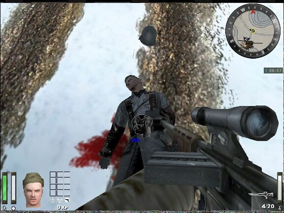

How Does The Uniform Swapping Work?

A Covert Ops can steal a uniform from a slain enemy. When this happens, you will see a "grabbing" icon show up. Hit activate and the status bar will show you how much longer it will take before you have a new uniform. The enemy soldier must be gibbed  before the uniform can be taken, and you will only have a few seconds until the gibbed body disappears into the ground. However a not very well known fact is that you can still take the uniform after the body disappears from view, even though no status bar will be displayed. Just keep the activate key held down and wait. This looks like it is a bug in the game.

Once a uniform has been stolen, the enemy will literally look like you stole his pants

When you see an enemy Covert Ops form a distance, you will see the class, rank, and name of the person from whom the Covert Ops took the uniform.

If you move a little bit closer though, and the distance is still considerable, then the class, rank, name information will disappear, letting you know that they are not on your team.

If a friendly team member targets you, he will be warned with a huge red symbol not to shoot you. The "no-shoot" symbol has been made more prominent (thicker) in Final.

#
## Other Tips For Covert Operators

Here's a couple of things I've run across - most are pretty common sense, but I thought I'd list them anyways.

1.  Most everyone already knows that if a field ops can see an enemy, they show up as icons in everyone's command map right? This can be useful when you are in scoped mode looking for people hiding behind things or in the trees. While in scoped mode, pull out your command map. It will show you where people are, even though you can't actually see them but they are still within your field of vision and not behind an object like a building. So, while you don't have a visual on them, you will see an icon representing where they are and their general facing so that all you have to do is wait for them to poke their little heads out.
2.  Also when a disguised Covert Ops is looked at by a Level 4 Field Op his icon reverts to his team colour on the maps and "Enemy In Disguise" is written above his heads where the players name should be.
3.  A Covert Ops in disguise can pass through enemy-only doors. This is particularly helpful when accompanied by an engineer - you can get to some objectives very quickly
4.  The Covert Ops' satchel charge is a much more efficient way of blowing thru obstacles enroute to the objective than using the engineer's dyno. It blows quicker and it doesn't use up the engineers charge bar.
5.  Scout around with your binoculars to [spot and mark mines for your team](/mine.md)