# Enemy Territory Help

- [Enemy Territory Help](#enemy-territory-help)
  - [Getting Started](#getting-started)
  - [What's Changed Since Test?](#whats-changed-since-test)
  - [New and Improved Limbo Menu](#new-and-improved-limbo-menu)
  - [Player Classes and Equipment](#player-classes-and-equipment)
  - [How Do I Write Weapon & Class Binds?](#how-do-i-write-weapon--class-binds)
  - [Weaponbank Assignments](#weaponbank-assignments)
  - [Can Spawnpoint Scripts Be Used In ET?](#can-spawnpoint-scripts-be-used-in-et)
  - [So What New Commands Will I Need?](#so-what-new-commands-will-i-need)
  - [Other Frequently Asked Questions](#other-frequently-asked-questions)

Other documents referenced here, but links broken, or included but not shown on the site:
- [Fireteams](fireteam.md)
- [Chatting](chat.md)
- [Covert Ops](covert.md)
- [Mines](mine.md)
- [Mortar](mortar.md)
- [Weapon Spread](spread.md)
- [XP - Experience Points](xp.md)

## Getting Started
First, you need to go into the Game Dir/Enemy Territory/Docs folder and look for a file called PlayerGuide.html. That will give you a quick introduction to the new player classes and game mechanics.

I think that you'll find most of what you know in RTCW ports over pretty well to Enemy Territory. For sure, lots of people will drift towards the new weapons and classes at first, but give it some time and everything will even out.

## What's Changed Since Test?
This is not an all inclusive list, but I thought I'd highlight some of the game changes (but not bug fixes), many made in response to community feedback, that Splash Damage/id/Activision made to the game since the release of Test. All I can say is, "WOW!!!". There should be no doubt that the developers listened closely to what the community said they wanted from the game and delivered in spades. Thanks!

1.  Player animations are much much smoother now
2.  Map load times drastically improved
3.  Echo statements returned
4.  Headshots (with or without helmet) with scoped rifles now cause instant death
5.  Headshot damage reduction from helmets standardized to -20 damage, except for headshots by scoped rifles (K43 or Garand)
6.  Panzerfaust blast radius reduced by 25%
7.  Models for med and ammo packs changed to mirror what you see in the ammo racks and make it easier to distinguish what is lying on the ground
8.  Wire added over the top of the Fuel Dump wall breach to prevent stacking
9.  Health is now shown as a discrete value in addition to the health bar
10.  General calls for "medic" on player death made distinct from player-initiated requests for "medic!" and sound off in the local environment rather than as a global voice message. Enemy players nearby can also hear the call for "Medic". "Medic!" text spam whenever a player is killed has also been removed
11.  Three additional ranks added (Brigadier General, Major General, General) for achieving Level 4 in 5, 6, and 7 skills respectively
12.  Experience gained per health or ammo pack reduced from 2 per pack to 1 per pack
13.  Grenade physics changed back to original RTCW physics
14.  Audible signals sound when votes are called (bell chime) or when referees take an action (referee's whistle)
15.  Quick chat structure now completely mirrors the RTCW chat structure. New chats have been added to the END of the appropriate menus
16.  Voices completely reworked and many favourites, including multiple variations (cheers, etc) brought back
17.  New sound effects added - some guns for sure, not sure what else
18.  Double-tap to prone can now be turned off via the Options Menu
19.  "No shoot" symbol when targeting disguised covert ops made a little more prominent and seems to pop up faster
20.  "No shoot" symbol shown when player takes a position from which they cannot use the weapon (e.g., panzer from prone)
21.  Some skill level awards renamed to make benefits more clear (e.g., Adrenaline is now known as Full Revive)
22.  If you run over an ammo pack with 2 magazines, you are told that you picked up a "Mega Ammo Pack"
23.  Spread on MG-42s increased slightly
24.  Constructable command posts now have a flag indicating which team built it
25.  Added end-game animations to the maps
26.  Axis medic skin changed - no longer wearing an overcoat; other skins made more detailed such as the Axis Field Ops
27.  Axis and Allied satchel charges are now different colors
28.  Objectives are voiced at beginning of map and after certain gates are reached (e.g., Tunnel doors blown)
29.  Face is now more animated and when the first headshot is received, the helmet is removed
30.  Construction noises now sound when building something
31.  Player given warning if standing in a construction zone
32.  Player guide expanded and improved significantly. Gives detail behind experience points, skills, and lots more "how to"
33.  Standing at tank-destroyable doors result in player death if in blast area

## New and Improved Limbo Menu
The first thing that you will notice is the new limbo menu. The developers have done a great job of putting everything, that used to take multiple click views, into one control panel:

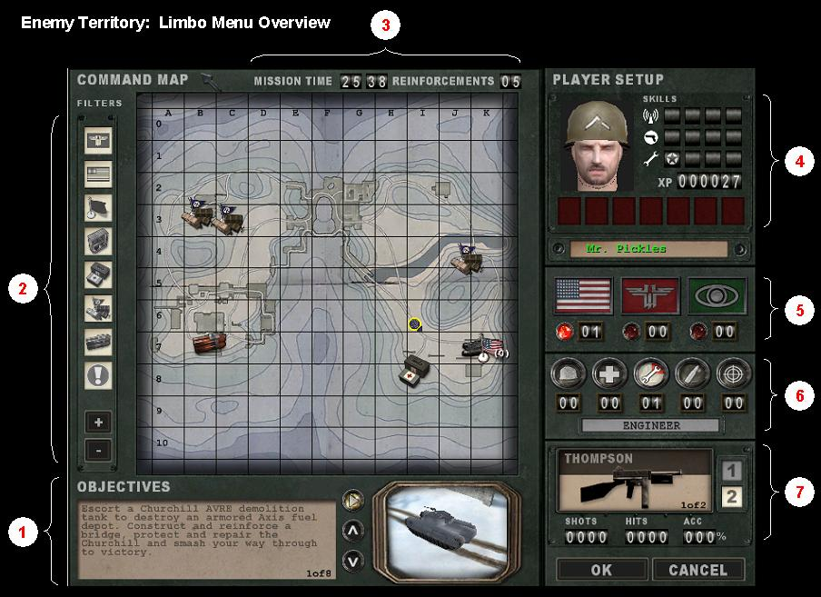

1.  Objective Summary
2.  Command Map. The buttons to the left enable you to select what you want to show on the command map and how large the icons will appear. To select spawn sites, use the command map and click on any of your side's flags and at next respawn that's where you will start off
3.  Game Timers
4.  Skills and Experience Summary
5.  Team Summary. Shows how many allies, axis, and spectators are currently in-game
6.  Class Summary. Similar to the /classes command in Shrub. Shows how many of each class currently are on your team
7.  Weapons Selection and Stats. Notice that there is "1 of 2" under the picture of the SMG. This indicates that the Thompson is 1 of 2 weapons available to the engineer. Click on the SMG and you will see a drop down box showing all the weapons available to you, based on selected class. Click on one to select.

## Player Classes and Equipment
All of the original classes are back with one addition and one re-naming. Here is a quick summary of what has changed, gains from experience notwithstanding, with each class:

**Class Changes from RTCW**  
Soldier  
*   Lost ability to select Venom (gone), Sniper rifle (changed), or non-default SMG
*   Added ability to select MG42 and mortar

Engineer  
*   Required to construct game objectives
*   Required to repair vehicles
*   [Ability to plant land mines (weaponbank 7)](mine.md)
*   Ability to defuse land mines and satchel charges
*   Option to select from one of 2 weapons
*   Spawns with only 4 grenades but can accumulate up to 8 through ammo packs

Medic  
*   None as far as I can tell

Field Ops (aka Lieutenant)  
*   Name change from Lieutenant
*   Airstrikes now require 100% bar
*   Number of airstrikes at one time limited
*   Limited to default SMG. Cannot select other weapons
*   Artillery barrage now has 8 shots vs 4 but smaller blast radius per shot

Covert Ops (new)  
*   Ability to detect mines (Use binoculars, and keep looking at them till it plants a flag)
*   [Ability to acquire enemy uniform](covert.md)
*   Performs role previously filled by Soldier-Mauser
*   Can choose from one of 3 weapons
*   Can plant satchel charges (weaponbank 6) and use smoke grenades (weaponbank 5)

With the exception of the Medic and Field Ops, everyone gets a bunch of weapons to play around with. Medics and Field Ops just get the default SMG.

**NOTE: This was tested by launching two instances of the game, creating a fireteam (so I could see a discrete health figure), then shooting the crap out of myself.**

A couple of observations:  
1.  Headshot damage has been reduced by 20 points when the target has a helmet
2.  MP40s and Thompsons do the same amount of damage
3.  Scoped weapons will do more damage (body and head) while in scoped mode
4.  Base pistol damage has been upped to 18
5.  Range affects damage. Pistols, SMGs, and the FG42 deal half damage at long range. I don't know what consitutes "long range" but I tested shooting from the top of the MG42 hill to the Allied side of the bridging site on Fueldump

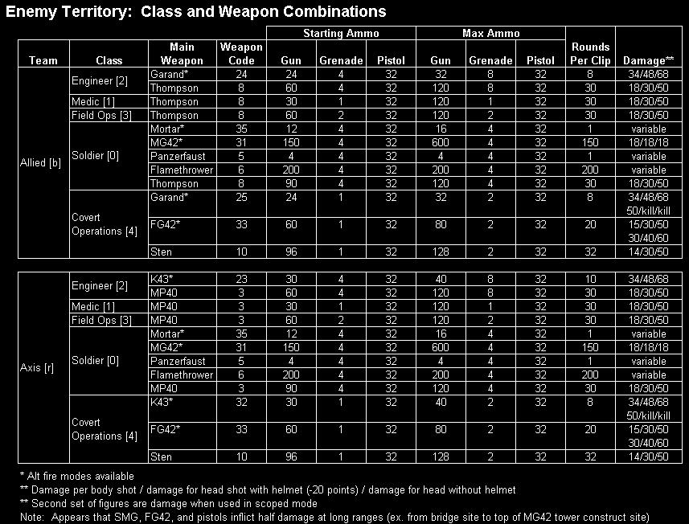

## How Do I Write Weapon & Class Binds?
For those of you who want to write class selection binds and scripts, the team/class/weapon variables have been changed significantly. Now, the three seperate variables from RTCW are combined into a single "team" variable, which takes the form:

bind x "team \[team\]\[playertype\]\[weapon\]"

Where:

1.  \[team\] is r=axis, b=allies
2.  \[playertype\] is 0=soldier, 1=medic, 2=engineer, 3=field ops, 4=covert ops
3.  \[weapon\] is 3-35 (see chart above)

So a bind to spawn me as an Axis engineer with the K43 w/ grenade launcher would look like this:

bind x "team r 2 23"

## Weaponbank Assignments
For those of you who want to write scripts involving weaponbanks, here are the assignments for weaponbanks 1-7 by class. You'll notice that there is an additional weaponbank (7) and it's only used by the engineer.

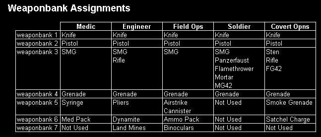

## Can Spawnpoint Scripts Be Used In ET?
Yes and no. For each map, there are spawnpoints associated with spawnpoint0 - spawnpoint4. However, the assignment of spawnpoint numbers to spawnpoints is inconsistant. In RTCW, spawnpoint1 would always spawn you at the rearmost axis spawnpoint. Not so in ET. Here is a chart of maps and spawnpoint assignments:

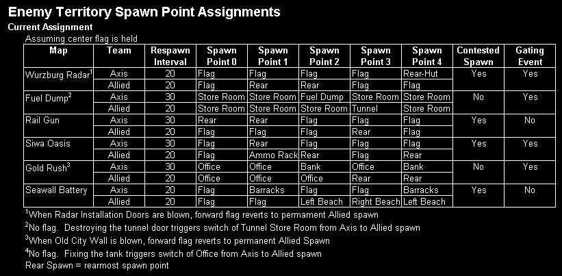

## So What New Commands Will I Need?
Since people are going to want to know how much their basic configs have to change, I thought I'd offer up the list of commands I had to add to my RTCW config. The good news is that I was able to copy just about all of my scripts and configs from RTCW to ET, all except for the class select script.

*   bind x "+prone" //sends you to the prone position. Click again to stand up
    
     
    
    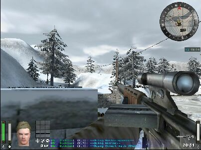
    
    Standing

    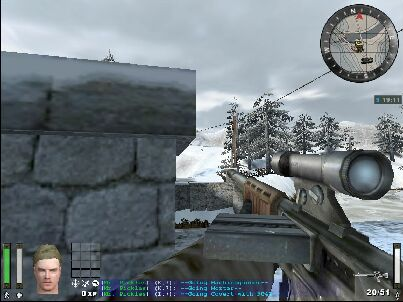
    
    Crouched
    
    
    
    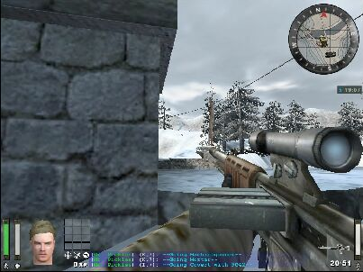
    
    Prone
    
    A couple of things to keep in mind while prone
    
    *   When crawling, you can't shoot, change weapons, or reload
    *   If you are crouched, you can double tap forward to enter the prone position (you can turn this option off thru the Options Menu)
    *   MG42s in the alt fire mode (bipod down) can only be fired from the prone. While in the alt fire position, you will also have a limited arc of fire, so be careful about your facing before getting into the prone position
    *   If you are prone, you can't set up your mortar
    *   Panzerfausts cannot be fired from the prone position
    *   If you use a crouch toggle and were in the crouched position when going prone, you will be crouched when you leave the prone position
    *   You can also jump while in the prone position to get up quickly
    
*   bind x "+mapexpand" //brings up an overhead map of the battlefield.
    
    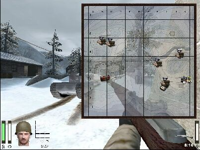
    
    Tips:
    
    *   You can still move and shoot while your command map is up, much like the scoreboard in RTCW.
    *   If you have a Field Ops on your team, every enemy he can see will be marked on your map
    *   Mortar gunners can see where artillery and their mortar rounds hit on the command map
    
*   bind x "+stats" //slight change from the stats command in shrub and OSP. Notice this also tells you how much experience is needed to achieve the next skill level
    
    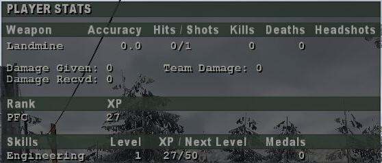
    
*   bind x "mapzoomin" //zooms compass map in
*   bind z "mapzoomout" //zooms compass map out
    
     
    
    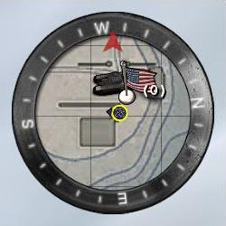
    
    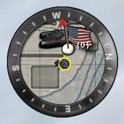
    
    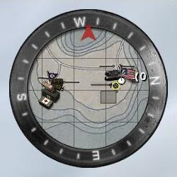
    
    Default level of detail
    
    zoomed in 2X clicks
    
    Zoomed out 2X clicks
    
*   bind x "weapalt" //same command as previously used with Mauser, just applicable to more weapons and classes now
*   bind x "openlimbomenu" //previously I did not have this bound but now the limbo menu now shows more information
*   bind x "mp\_fireteammsg" //messaging to a pre-selected sub set of the team
*   bind x "messagemode3" //free text messages to a pre-selected sub set of the team
*   bind x "mp\_fireteamadmin" //calls up the fire team admin menu
*   bind x "weaponbank 7" //rolled this into a weapon toggle with my grenades
*   bind x "wm\_sayplayerclass" //Voices your current class
*   bind x "autoscreenshot" //takes a time and map stamped screenshot
*   bind x "toggle cg\_atmosphericeffects" //turns off rain and snow
    
*   seta cg\_crosshairColorAlt "red"
*   seta cg\_crosshairColor "red"
*   seta cl\_doubletapdelay "0" //sets max delay for double-tap to prone, set to 0 to disable
*   seta cg\_reinforcementtime "1" //draw reinforcement timer under game timer

## Other Frequently Asked Questions
*   **Why can't soldiers pick the Mauser rifle?**  
    For the most part, sniper weapons have been moved over to the new class, Covert Ops. They get to choose from either the FG42 or a silenced, scoped sniper rifle.
    
*   **What! No venom?**  
    Nope. The venom was retired for a mobile MG42. I think you'll get used to the MG42 real quickly and learn how to use it in the most effective way. A couple of notes on the mobile MG42:
    
    *   150 rounds per belt
    *   4+1 belts max loadout
    *   ~30-35 rounds a second
    *   No spin up time
    *   MG 42 does overheat
    *   2 firing modes:
        1.  not on bipod: can move, very inaccurate
        2.  on bipod: must be in prone, can crawl\*, much more accurate
    

*   **What happened to the Lieutenant? How am I going to get my ammo?**  
    The Lieutenant has just been rebranded as the Field Ops Specialist. The Field Ops can do everything the LT could except pick from the 3 available SMGs. The reason for this is the promotion and ranks system associated with experience. It would get confusing to have someone named Lieutenant Sergeant Iffy.
    
*   **WTF? How do I select spawn points?**  
    Call up the limbo menu and look for the American or German flags. Those represent the spawn points. use your cursor to click on any of your sides spawn points and that's where you'll respawn. There is a way to select spawn points through the use of a spawn point script, but there is currently no standard naming/numbering convention for spawn points.
    
*   **The game doesn't recognize MOUSE3. What's up with that?**  
    This is a problem I had. ET would not recognize the same MOUSE3 bind that I use for RTCW. Uninstalling the Logitech Mouseware program fixed this for me. On another note, you can now bind MOUSE4 and MOUSE5.
    
*   **What happened to +dropweapon?**  
    Currently, +dropweapon doesn't work. However, you can still exchange weapons. Any class, which has multiple weapon options, can exchange their current weapon for another - as long as the new weapon was originally available to them. The exception is that engineers and medics can pick up the other side's default SMG. To exchange weapons, stand over the new weapon until the tool tip appears, then hit +activate.