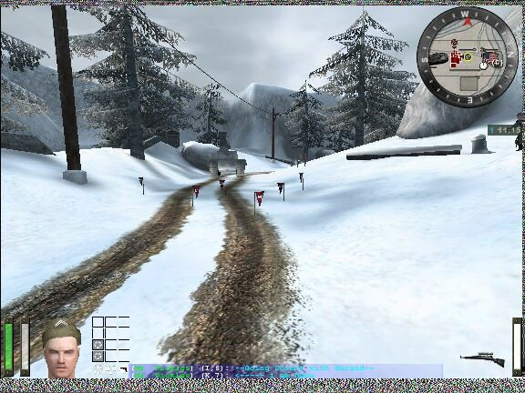

## A Mine Is A Terrible Thing To Waste

First, bind a key to weaponbank 7. Each side can emplace up to ten (10) mines PER SIDE. An engineer must have at least half a charge bar in order to generate a mine. Once generated, point your pliers at it and arm it. All friendly troops will see friendly mines as either blue or red flags depending on your team. Remember, you cannot plant mines inside buildings. 

Once land mines have been spotted, there are 3 ways to get rid of them:

1.  Get an engineer to defuse a mine just like you would defuse dynamite. To defuse a mine, approach a flagged mine while in the prone position. You should see a grey defuse symbol come up when you get close enough. Pull out your pliers and defuse the mine.
    

    
1.  Use any explosive weapon on one. Grenades, panzers, mortars, airstrikes, and artillery will all clear mines. While I haven't tried, dynamite and satchel charges should work too. NOTE: This only works on detected mines. You won't be able to arty a suspected minefield and expect to clear it.
2.  Step on one. You should hear a audio cue just as you trigger the mine (hissing sound and a small puff of smoke) that, if you're quick enough, should give you time to save yourself. I played around with this and if I strafe jumped away just as I heard the audio cue, I would survive but take 50-60 points of damage. NOTE: If you step on one, but DON'T STEP OFF, it won't detonate. It will become visible and therefore defusable if a friendly engineer is in the area. Otherwise, you'll just have to resort to technique #2.

**Land Mine Tips**

1.  Remember that your TEAM is limited to 10 mines at a time, so coordinate with other engineers for placement
2.  Make sure you place land mines where they can be covered by fire. If they aren't being covered, then you're wasting a valuable defensive resource
3.  Once land mines have been spotted, it is a good idea to NOT disarm them if you don't have to. Each team only has 10 to place at any time, and it is safer to deal with the ones you know about... then the ones you don't.

Covert Ops can spot mines by using their binoculars. As seen in the picture below, I've already spotted and reported 2 mines. They are marked by red flags, indicating that they are enemy flags (I was allied). To the right, are the white outlines of another 3 mines I've spotted. The status bar shows that I'm in the process of reporting the mines to HQ.

Once a Covert Ops reports mines, they will show up as either red or blue flags, depending on the team, and show up in your compass as red or blue mine symbols.

You can also see where all of the enemy mines are located by calling up the command map. They will be marked on the command map in the same way as your compass map. You can see a cluster of mine symbols in grid J7.