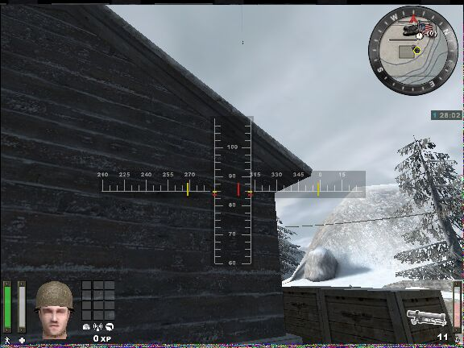
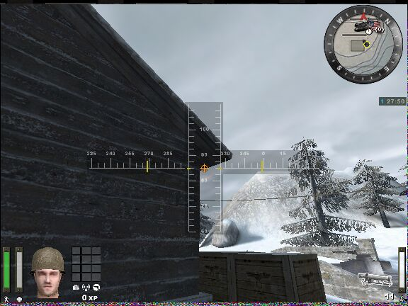
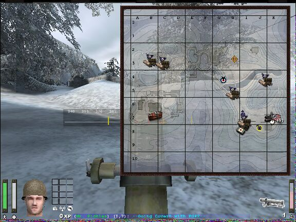

# Mortar

## What's A Mortar?

The mortar is a new indirect fire weapon available to the soldier. This weapon can only be fired once it has been emplaced (weapalt). The mortar gunner starts off with 12 rounds but has a maximum ammo load of 17 rounds. Each shot takes half of the charge bar. Once the mortar is set up, you will see an elevation scale and a traverse scale. This indicates your firing limits. Moving the elevation scale up will cause the mortar round to drop closer to you but will enable you to shoot over obstacles. Moving the elevation scale down, will send your shot in a flatter arc, but you might hit intervening obstacles.

After you fire a round, you will see a set of red marks on your targeting scales. This shows the settings of your previous shot. It looks like 55 degrees gives you the maximum range on flat ground. At 55 degrees, a round will travel about 5 grid squares. I hope you all boned up on your trigonometry.



If a Field Ops calls for artillery fire and the point of impact is within your firing arc, you will see an orange crosshair appear on your targetting scales. This really only indicates the direction of the artillery strike and not the settings you need to land a mortar round in the same spot. In fact, using the orange crosshair as your settings for the next shot, could have disasterous consequences - I blew myself up once.



Another tool available to the mortar gunner is the command map. Call up the command map after an artillery strike by a field ops, or after a mortar shot and you will see either a red, white, and blue bullseye (shows where the mortar round hit) or an orange crosshair (where the artillery barrage landed).



Mortar Tips

1. Learn how to read the top graphical features shown on your command map - it will really help you figure out where you're shooting
2. After you've fired off a round, but before it lands, call up the command map. You will see a marker show up when the round hits and you can get right back to adjusting fire
3. When trying to determine range, learn how to bracket your shots. If the first round lands short, send the next one long, and successively halve the adjustment. If you try to walk the round up to the target, you could be trying forever.
4. You can make a range card pretty easily by finding some level ground and practice shooting. Take a piece of cardboard and measure from the center of your symbol to the center of the mortar marker and record the elevation setting you used.
5. Remember, when shooting from a higher to lower elevation, your rounds will travel a little further. Likewise, when shooting from a lower to a higher elevation, your rounds will not travel quite as far.

Anyone having problems nailing the elevation-to-range issue with your shiny new mortar? One thing you can do is make yourself a simple little range card template to do the conversion for you. Here's how you make one:

1. Grab yourself a stiff piece of clear plastic (a 4" x 4" piece works for my screen res). I took the cover off an old CD jacket
2. With a fine marker, draw a line at the 45 degree angle from the edges
3. Start a local server and spawn with the mortar.
4. Find a flat piece of terrain to shoot across, set your elevation at 45 degrees, and shoot
5. Call up your command map and see where the shot land. Now, take your plastic template, hold it over your screen, and place the corner dead center over the icon that represents you. Use the 45 degree line to connect your icon with the icon representing the mortar hit. Make a mark and annotate it as 45 degrees
6. Continue in 5-10 degree increments up to about 80 degrees
7. When you are done, what you should have is a range ruler that you can use to measure the distance, and therefore the required elevation, from your position to anywhere on the map. I tried this out and got 4 1-shot hits.

A couple of things to remember:

* When shooting from higher to lower, your shots will travel further than on level ground
* When shooting from lower to higher, your shots will travel not as far as on level ground

If you are having problems keeping your command map out, here is a simple script that you can use to pull your map out with one click and put it away with a second click:

````text
//Command map script  
//keeps map out until put away. used mostly when spotting artillery/mortar fire  

set mapout "+mapexpand; +mapexpand; set nextmap vstr mapin"  
set mapin "-mapexpand; -mapexpand; set nextmap vstr mapout"  
set nextmap "vstr mapout"  
bind x "vstr nextmap"
````
