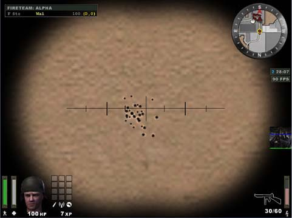
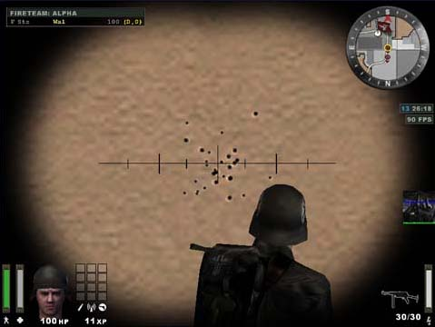
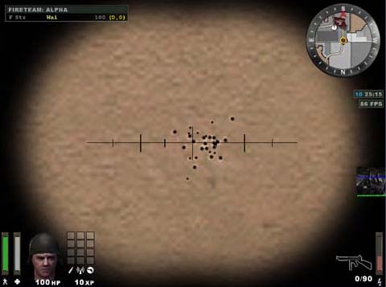
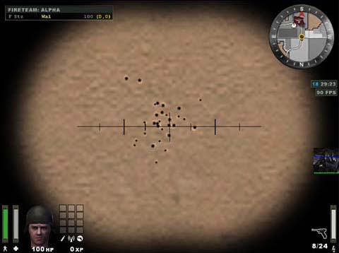
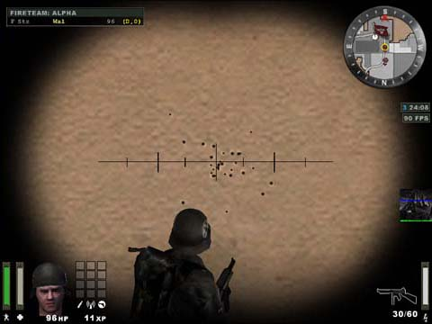
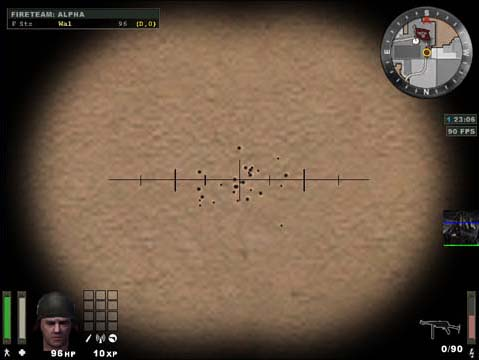

# Enemy Territory: All about Spreads

1st I would just like to clear up a Myth that I think comes from the RtCW days, Thompson's and MP40's are **EXACTLY THE SAME** the spread is more or less the same, see pics 1-6, the fire rate is the same on both weapons (about 4.5 secs to empty a full clip\*) and they both hold 30 bullets in a clip.  
 

Thompson Close range:  

MP40 Close range:  

Thompson Short range:  

MP40 Short range:  

Thompson Medium range:  

MP40 Medium range:  

Ok now down to the Nitty Gritty:-

1) Prone/crouched/standing pose significantly affects the spread but only when shooting long bursts (see [here](http://www.net-clan.com/WolfWeb/all_positions.jpg) and [here](http://www.net-clan.com/WolfWeb/all_positions_closeup.jpg)). If you shoot shorter bursts (preferably 2-3 bullets in a row) spread appears to be near to identical in all three poses. Along with slower (than in RtCW) fire rate it allows to control your fire very well. This all applies to **MP40/Thompson/Sten** only. **Garand**, **K43**, **FG42**  all have the same spread in any pose.

 Spread while crouched equals to spread while prone. If you try to shoot while jumping, spread increases enormously, though sometimes 1 bullet out of 10-15 does hit the exact point you were aiming for. That explains for rare (and unforgettable) mid-air sharp-shooting feats. But you still can't rely on that :(

2) **Light Weapons skill.** Only Level 4 of this skill awards you with 35% spread reduction (not Level 3 as the ET manual says).

3) If you have reached **CovOps Level 3** skill, along with 50% reduction in recoil jump and weapon sway with sniper rifles (while scoped) you also get a 35% spread reduction with Sten and FG42 as well. Spread in crouched/prone positions decreases proportionally. Also, CovOps Level 3 skill appears to be transponible: if you switch from Covert Operations guy to any other class, with the only skill you possess by this moment being CovOps Level 3  you will also find your MP40 and Thompson spread reduced by 35% just as if you were on **Level 4 in Light Weapons**. Spread in crouched/prone positions decreases proportionally. And thats not all: at CovOps Level 3 even **MG42**s spread is affected significantly (about 50% reduction !!!)  see [here](http://www.net-clan.com/WolfWeb/MG42_spread.jpg)

    Now hold on, even more candy comes: if you (regardless of your current class and any other proficiencies acquired) have reached **CovOps Level 3 + Light Weapons Level 4**, you will have your MP40 and Thompson spread reduced even further (all in all, almost halved against its original scale), while Stens spread (also seems to get halved) becomes near to negligible making it the deadliest mid-range sniping weapon.

4)     **FG42**. This weapon has the ugliest accuracy available. Shooting short bursts also doesnt pay in its case. In unscoped mode its spread even exceeds that of unscoped Garand and K43 (see [here](http://www.net-clan.com/WolfWeb/FG43_Sniperrifles.jpg)). Meanwhile FG42 also gets its 35% spread reduction bonus. **BUT:** only at **CovOps Level 3** (Light Weapons Level 4 does not add to this weapon anything). See FG42s best [here](http://www.net-clan.com/WolfWeb/FG42_all_spreads.jpg).

And, strange thing: as you get to CovOps Level 3, thats where shooting crouched starts bringing some dividends (visually like a 10-15% spread decrease. [here](http://www.net-clan.com/WolfWeb/Level3CO_FG42.jpg)). And thats all, folks. No more perks, even if you have collected all skills possible.

5) Same thing with **MG42**: you wont see it more accurate after having reached **CovOps Level 3** (Light Weapons Level 4 does not add to this weapon anything). Though I daresay 50% reduction is quite sufficient as it is. Allows even for some MG42-sniping ;) Think of it once more [here](http://www.net-clan.com/WolfWeb/MG42_spread.jpg).

6) **Sniper rifles**. Unscoped Garand and K43 keep the same spread scale at **any and all** skills/levels with any class capable of handling them (CovOps and Engineer). When scoped, spread is immaterial.

7) **Heavy Weapons** skills do not affect spread scale.

Pistols have not been covered in this review, as I believe their spread is not exactly sensible, while their crosshair-shifting recoil makes it impossible to precisely measure the spread borders.

\*The times varied between 4.48-4.94 for the Thompson and  4.48-4.81, so i averaged it out at 4.5 because of "human" error (ya thats me ^^ ) 

#
## RESEARCH METHODOLOGY

`/g_gametype 2`  
`/devmap mapname`  
`/timelimit 0**`

 Then choose your class, stand in front of a light wall to clearly see the bullet holes (I was in the first Axis respawn on Goldrush).

`/cg_marktime 2000000`  
`/give ammo`

Shoot out like 10 clips in one point to distinctly see your current spread borders.

 Then play with skill parameters:

 `/give skill`  (_with no additional parameters this command will be awarding you with all available skills consecutively: Level 1 thru Level 4 as you type it in._)

 To experiment with some certain skills enter:

`/give skill X`

     where **X** _is:_

    0  Battle Sense skill

    1  Engineer skill

    2  Medic skill

    3  FieldOps skill

    4  Light Weapons skill

    5  Soldier skill

    6  CovOps skill

 For more fun and visuals you can also use

`/g_debugbullets 1`  
`/cg_railtrailtime 60000`

To nullify all skills and marks on walls

 `/map_restart`