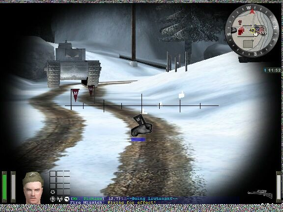

# What's This I Hear About Experience?

Enemy Territory has introduced a system by which players can gain additional abilities as they do their "job" and participate in the game. Every class has a set of four skills specific to them (Engineering, Signals, Heavy Weapons, Covert Ops, and Medical). Additionally, there are two other skill sets that are generic to all classes (Battle Sense and Light Weapons). To get a better sense for how the skill system works, read the PlayerGuide.html document inside the docs/ folder.

What I want to do now is just list the skills and describe what they do. The experience point levels and points earned per action might be slightly off, but the skill names and descriptions come courtesy of Activision. The format is:

\[Skill Level\]\[Name of Skill\]\[Experience Points Required\]\[Description\]

#
- [What's This I Hear About Experience?](#whats-this-i-hear-about-experience)
  - [Engineering](#engineering)
  - [First Aid](#first-aid)
  - [Signals (for Field Ops)](#signals-for-field-ops)
  - [Heavy Weapons (for Soldiers)](#heavy-weapons-for-soldiers)
  - [Covert Ops](#covert-ops)
  - [Battle Sense](#battle-sense)
  - [Light Weapons](#light-weapons)
  - [Other Experience Point Bonuses](#other-experience-point-bonuses)
  - [How Do Ranks Correspond To Experience?](#how-do-ranks-correspond-to-experience)
  - [How Are The Medals Awarded At The End Of The Game?](#how-are-the-medals-awarded-at-the-end-of-the-game)
  - [How Will Server Admins Be Able To Customize The Experience System?](#how-will-server-admins-be-able-to-customize-the-experience-system)

#
## Engineering

*   Improved use of Explosive Ammunition \[20\] - Starting inventory includes four extra rounds of ammunition for the Rifle Grenade and four extra grenades  
    
*   Improved Dexterity \[50\] - Arming and defusing required half normal time  
    
*   Improved Construction and Destruction \[90\] - Constructing and repairing objects, using dynamite or land mines require 1/3 less powerbar than normal  
    
*   a Flak Jacket \[140\] - Provides the player with deflection of 50% from explosive weapons  
    

Engineering experience earned by:

Building constructables (5-7.5)  
Fixing broken MG42s (3)  
Fixing tank (7.5)  
Destroying final objective (10)  
Killing enemies with landmines or dynamite (4 per enemy killed)  
Killing enemies with rifle grenade (3 per enemy killed)  
Defusing enemy dynamite (6)  
Defusing enemy landmine (4)  

#
## First Aid

1.  Medic Ammo \[20\] - +30 ammo/+1 grenades at respawn  
    
2.  Improved Resources \[50\] - 2 syringes extra max ammo, 2 extra on spawn; med packs only consume 15% powerbar instead of 25%  
    
3.  Full Revive \[90\] - revives to full health  
    
4.  Adrenaline Self \[140\] - pull up your needle and then select needle again to activate. Requires a full charge bar. For 10 seconds, you have unlimited stamina and all damage taken is halved  
    

First Aid experience earned by:

Reviving teammates (4) but only if death was caused by enemy fire  
Giving Med Pack (1 per pack taken)  

#
## Signals (for Field Ops)

1.  Improve resources \[20\] - ammo packs give 2 magazines and 2 grenades; ammo packs only consume 15% powerbar instead of 25%  
    
2.  Improved Signals \[50\] - artillery and airstrikes strikes only require 2/3 charge bar  
    
3.  Improved Air Ground Support \[90\] - Air strikes result in 2 bombing runs, artillery strikes last twice as long  
    
4.  Enemy Recognition \[140\] - When you put your crosshairs over a disguised enemy Covert Ops it will say 'A disguised enemy!' instead of the name of the person who's clothing they stole. Disguise enemy also shows up in command map as a crosshair labeled "disguised enemy"  
    

Signals experience earned by:

Giving ammo (1 per pack taken)  
Killing enemies with artillery (4 per enemy killed)  
Killing enemies with airstrikes (3 per enemy killed)  
Destroying objectives (5)  

#
## Heavy Weapons (for Soldiers)

1.  Improved Projectile Resources \[20\] - Firing panzerfaust and mortar require 2/3 normal charge  
    
2.  Heavy Weapon Proficiency \[50\] - Cooldown rate doubled for emplaced and mobile MG42  
    
3.  Improved Dexterity \[90\] - Weaponbank 3 movement penalty reduced, except for flamethrower when firing  
    
4.  Improved Weapon Handling \[140\] - Offered an option to choose an SMG in place of the pistol for weaponbank 2  
    

Heavy Weapons experience earned by:

Killing enemies with any heavy weapon (including mounted MG42 and tank-mounted .30 cal machineguns) - (3 per enemy killed)

#
## Covert Ops

1.  Improved use of Scoped Weapon Ammunition \[20\] - Inventory includes one extra clip of ammunition for Scoped Weapons  
    
2.  Improved use of Sabotage and Misdirection \[50\] - Satchel charges and smoke grenade only require 2/3 normal charge  
    
3.  Breath control \[90\] - Recoil pitch and swaying halved on scoped weapons  
    
4.  Assassin \[140\] - Instant kill with any back-stab  
    

Covert Ops experience earned by:

Blowing up constructables (7)  
Detecting mine (3 per mine detected)  
Killing enemies with scoped fire (5 per enemy killed)  
stealing uniform (5)  
Killing enemies with satchel charge (5 per enemy killed)  

#
## Battle Sense

1.  Binoculars - Can call up binoculars using +zoom  
    
2.  Improved Physical Fitness - Stamina increases at 160% rate  
    
3.  Improved Health - Slightly increases max health by 15 points  
    
4.  Trap Awareness - you will be able to see white outlines of mines  
      

Of all the skills, Battle Sense is the "fuzziest". Well, McAfee and Popoco have spent a lot of time experimenting and drew the following conclusions:

The game awards battle sense to all the players every certain time (around 45 secs). We call this the "Battle Sense Timer". Basicly the game verifies if you were in the heat of battle and awards you points for it when the Battle Sense Timer expires.

How are the points awarded?

First of all, if you die before the timer expires you loose all the points you could have won. You have to succesfully complete that "Battle Session".

If you survive the Battle Session you get the following xp points:

2xp = If you give damage or recieve damage, but not both.  
5xp = If you give and recieve damage, but no kills.  
8xp = If you give and recieve damage, and you also kill someone.

> Notes:

\* If you die, you get no points.  
\* If you kill someone flawlessly, you still get 2xp.  
\* Situations cannot be duplicated. If you kill more people, or do even more damage, you still get the same Battle Sense.

#
## Light Weapons

1.  Improved use of Light Weapon Ammunition \[20\]- Beginning inventory includes 1 extra clip of ammunition  
    
2.  Faster Reload \[50\]- reloading takes 35% less time  
    
3.  Improved Light Weapon Handling \[90\]- Weapon spread of SMG/FG42 is reduced by 35% while pistol recoil is halved  
    
4.  Dual-Wield Pistols \[140\]- can select dual pistols from the limbo menu  
    

Light Weapons experience earned by:

Killing enemies with light, unscoped weapons (2 per enemy killed - may be dependant on range)  
Killing enemies with unscoped headshots (5 per enemy killed)  
Killing enemies with hand grenades (3 per enemy killed)  

#
## Other Experience Point Bonuses

Returning objectives (0)

Killing teammates (-3 per FILED complaint)

Destroying tank (10) - points may be assigned to different skills based on method of destruction (e.g., grenades, panzerfaust, etc)  

#
## How Do Ranks Correspond To Experience?

Ranks are earned by increasing your skill levels. However, the rank system rewards the well rounded player who can excel at multiple classes as well as basic combat. I don't have a chart that maps skill levels to rank, but it seems that in order to reach Colonel, you need to reach level 4 in at least 2 classes, as well as level 4 in some other disciplines (light weapons and battle sense). If you just concentrate on one class and only gain skill there, you will be capped in rank but I'm not sure which one.

Here's how the progression works

*   Rank, up to Lieutenant, is determined by the level of your highest skill. Every skill level gained in that skill results in a promotion. You can attain a maximum rank of Lieutenant (4 promotions) if by maxing out in only one skill
*   To gain further promotions, you must reach level 4 in multiple skills

So an example of ranking up will be:

1.  Private-PVT/Schutze-STZ (no insignia) = (This is how you start)
2.  Private First Class-PFC/Oberschutze-OTZ (one chevron) = Level 1 in one skill
3.  Corporal-CPL/Gefreiter-GFR (two chevron) = Level 2 in one skill
4.  Sergeant-SGT/Feldwebel (three chevron) = Level 3 in one skill
5.  Lieutenant-LT/Leutnant-LTN (one silver bar) = Level 4 in one skill
6.  Captain-CPT/Hauptmann (two silver bars) = Level 4 in two skills
7.  Major-MAJ/Major (gold oak leaf) = Level 4 in three skills
8.  Colonel-COL/Oberst (eagle) = Level 4 in four skills
9.  Brigadier General-BGN/Generalmajor-GMJ (one star) = Level 4 in five skills
10.  Lieutenant General-LTG/Generalleutnant-GLT (two stars) = Level 4 in six skills
11.  General-GEN/General-GNL (three stars) = Level 4 in seven skills

#
## How Are The Medals Awarded At The End Of The Game?

There are 7 medals you can win. One corresponding to each class - you receive this if you were the person with the highest experience in that class at the end of each round - and one for light weapons and battle sense. Each medal is represented by an icon in your limbo menu or by a letter after your name in the end of game summary. The number of times a letter shows up represents how many times you've won that award. The letter corresponds to the first letter in the name of each skill:

C - Covert Ops (White)  
F - First Aid (Yellow)  
E - Engineering (Green)  
S - Signals (Blue)  
H - Heavy Weapons (Magenta)

B - Battle Sense (Red)  
L - Light Weapons (Light blue)  

#
## How Will Server Admins Be Able To Customize The Experience System?

Currently, the only options server admins will have to customize experience is setting the number of rounds over which experience points and skills accrue to a player. Here are the current options:

1.  **Campaign** - 3 maps linked together. XP builds over all 3 games - and then resets at the next Campaign. Teams will see who wins each round... and then who wins the overall campaign. Even if team 'B' wins the first 2 rounds, the third map is still played to get overall scores (although team 'B' will be the winner).
2.  **SMO (Single Map Objective)** - Playing just 1 map to see who wins. After each game, XP is reset.
3.  **LMS (Last Man Standing)** - No objectives, no XP, no skills.
4.  **Stopwatch** - similar to SMO rounds. Skills and XP build, but after each round, the XP is reset. For example, I'm on Allies and get 2 promotions. Next round I'm on Axis with no promotions and trying to keep the other team from beating the time.