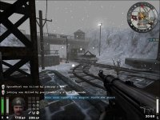

# Maps/Campaigns
- [Maps/Campaigns](#mapscampaigns)
- [North Africa Campaign](#north-africa-campaign)
  - [Oasis](#oasis)
  - [Seawall Battery](#seawall-battery)
  - [Gold Rush](#gold-rush)
- [Central Europe Campaign](#central-europe-campaign)
  - [Rail Gun](#rail-gun)
  - [Fuel Dump](#fuel-dump)
- [Custom Maps](#custom-maps)
  - [Supply Depot 2](#supply-depot-2)
  - [Reactor](#reactor)
  - [SOS Secret Weapon](#sos-secret-weapon)

#
# North Africa Campaign
## Oasis
  
The Axis base lies just on the other side.

The first map in the North Africa campaign is set near an old desert city, and tasks the Allies with blowing up two anti-tank guns deep within an Axis stronghold. The Allies can go in by force, blowing up a wall in the old city, or take a stealthier route, using tunnels under the city that must first be drained using water pumps.

A central spawn point can be found in the Old City, next to the second water pump and a room with health and ammo. Once through the wall, the two anti-tank guns can be found on the second floor at the very rear of the Axis post. Engineers will need to arm dynamite on each gun, and protect it for 30 seconds until it detonates.

**Allies**: The Axis initially spawn in the Old City, so you want to take this point as fast as possible. You'll need as much time as possible to attack the Axis post, so you don't want to find yourself making time-consuming runs from your initial camp to the Old City. Don't worry about the command post; don't worry about the water pumps; just take the Old City spawn point first, hold it for 30 seconds, and you'll be free do build everything else without distraction.

- In some cases, you might get lucky and a team of Axis newbies may leave the Old City relatively unguarded; otherwise, you can hug the route to the left, which eventually leads to the roof of the bunker. Chuck in a few grenades, and try to time your rush so that you reach the flag just as the respawn timer kicks in. With any luck, your team will spawn in right after you touch the flag, before any remaining Axis enemies can reclaim the room. Wipe them out, and the true assault can commence.

- Once you've breached the wall, the Axis will usually fall back and begin protecting the rear area of the compound. You should make sure the tunnels are drained, forcing the Axis to split their focus on two possible entryways. Axis Engineers will usually start planting mines in the rear yard, but you can avoid many of them by _not_ taking the staircases directly in front of the anti-tank guns; instead, there's a ladder underneath a mounted MG42 in the yard that leads to the second floor.

  
This is a good spot for the Axis to watch over the anti-tank guns.

**Axis**: One of the most common mistakes I've seen is for Axis teams to immediately scatter and leave the Old City spawn point unguarded. STOOOOPID!! It's a relatively easy room to defend, and the longer you hold this room, the longer you can stave off the full Allied assault. There's a health and ammo room right next door, and I've managed to hold down this room for extended periods single-handedly. Don't give it up without a fight!

- Once the Allies have breached the wall, your defences should revolve around the rear compound area. Mine the rear yard like crazy, especially the areas in front of the staircases leading up to the two guns. Make use of the mounted MG42, as well as several prime camping spots near the anti-tank guns.

- It's to your advantage to have the Allies spend as much time running back and forth before sending them back to limbo, so don't worry about moving forward to the Old City so you can shoot them the second they respawn -- hang back and play defence, and you should be able to fight the Allies off.  

#
## Seawall Battery
  
Getting up this hill will NOT be easy.

The second North Africa map is an uphill beachhead assault, and requires the Allies to destroy a set of gun controls inside an Axis stronghold. The Allies have two routes they can take: the main one up the beachhead requires an Engineer to build an access ramp, and a secondary path leads to the back of the bunker, where a disguised Covert Ops player can sneak in through a back door.

Either route is a rough one: a west bunker with mounted MG42s overlooks the main hill, and the Axis will often call in airstrikes to keep the Allies from getting out of the water. The secondary side path is also watched over by a rear bunker, and a narrow path that can be easily mined.

Towards the back of the bunker, a generator can be destroyed by either an Engineer's dynamite or Covert Ops' satchel charge. Once the generator is destroyed, numerous doors within the stronghold will open, including a rear door that allows access to the rest of the Allied squad. The interior of the base can be a maze; follow the blue signs to get to the Seawall Gun.

**Allies**: There are a few approaches that can be used for your initial attack. The first is to build the access ramp and gain control of the West bunker as quickly as possible. This is easier said than done: there are mounted MG42s overlooking the beachhead, and if the Axis are using air support, it can sometimes be hard to even get out of the water.

- Once you have access to the West bunker, it's imperative that someone stays behind to guard it -- it will allow you to send wave after wave of soldiers into the heart of the Axis installation without having to retake the beachhead.

- The more stealthy approach is to use the alternate spawn point and send in a Covert Ops class in the back door. First, you'll need to steal an enemy uniform and successfully make it to the back door -- no simple task if any Axis are paying attention at the rear bunker. Once inside, you can blow up the generator with a satchel charge. You can't blow up the cannon with your satchel, but you _can_ guard the generator in case an Axis engineer comes up to fix it. If you manage to succeed, signal to your team immediately -- it's a lot easier to attack from the rear bunker than the West.

- If you're unable to get a Covert Ops player in the back door, you'll have to go in by force. A Soldier with a flamethrower is useful for clearing out the front rooms -- just watch out for the mounted MG42 near the entrance. Have a Medic nearby to heal fallen teammates, and you should you should be able to sneak in an Engineer during a lull in the fighting.

  
A view overlooking the seawall gun.

**Axis**: The best starting strategy is to send one, maybe two Engineers to patrol the back pathway, mining the area and shooting _anyone_ who comes down the narrow passageway. _Everyone_ else should focus on the front beachhead and keep the Allies from building the access ramp as long as possible. Using air support, mortars and mounted guns, it's possible to hold off the Allies for the entire match; the longer you can keep them at bay, the less time they have to make their real assault.

- At the beginning of the match, the worst thing you can do is to let an Allied Covert Ops sneak in the back. If you get killed on the beachhead, it should be at the very top where players won't have time to steal your uniform. And there's absolutely no reason to open the back door -- don't do it!

- If the Allies have taken the front bunker, protect the hallway which acts as a nice chokepoint, watched over by the MG42. Have Medics nearby to keep your guards healthy, and you should be able to keep the Allies out for a while. You'll also want to have at least a few soldiers near the gun controls, in case someone gets close enough to plant dynamite.

- Basically **DON'T GO OUT THE BACK DOOR OR ONTO THE BEACH!!!!!!!!!!!!!**

#
## Gold Rush
  
Your initial objective: a Jagdpanther tank.

Maybe the best map of the group, "Gold Rush" is a tense affair set in the narrow streets of a North Africa village. The Allies need to first commandeer a tank and drive it along a pre-set path, using Engineers to blow up any barricades that may be in their way. You don't actually "drive" the tank; it will move on its own whenever an Allied player stands next to it.

Once the tank has arrived at its final destination in a lower courtyard, it will blow a hole in a side of a bank, where the Allies need to steal two crates of gold, load them onto a truck, and drive it back to their initial spawn point.

Adding to the difficulty: at any point, the Axis can damage the tank or the truck, requiring repairs before either can continue moving. The courtyard where the truck is located happens to be right outside an Axis spawn point, so the task of getting the gold out to the truck and driving off to victory is no mean feat.

  
When starting, don't get side-tracked -- head to the left.

**Allies**: There's no complex strategy to this map; you simply need to _work as a team_. Don't get side-tracked fixing the truck or blowing up truck barricades until you've taken control of the tank and gotten it down to the lower courtyard.

- Stealing the tank can be tough, as the Axis initially spawn in right next to the tank and will often call in airstrikes to the approaching area. Use airstrikes of your own to soften Axis defences, and then rush your Engineers in to fix the tank and get it moving ... which will claim that spawn point for the Allies. If it takes longer than five minutes to take the tank, you're in trouble.

- Once you have the area under control, have an Engineer take control of the command post. Since it's right outside the Allied spawn point, you should be able to easily control this post for the remainder of the map.

- As you first begin moving the tank, send in a few Engineers to blow the first tank barricade (assuming it has been built by the Axis). You should be able to provide solid cover with the Jagdpanther's assault gun.

- The escort down to the lower courtyard only gets tougher as you get further away from your spawn point. If you can get a hold of the two mounted MG42s in the lower courtyards, you'll be in good shape, as they overlook most of the exits from the Axis spawn point.

- A key moment is when the tank arrives at the location of the second barricade. If it has been built, the Jagdpanther's gun is fantastic for clearing out Axis players, and combined with the MG42, should provide cover for your engineer to plant dynamite and destroy the barricade. I've noticed that you can often tell how a match is going by how much time is left when the Allies break into the bank. Breaking into the bank in 10 minutes is a good sign; 15 means you're in for a fight, and 20 minutes means you're in trouble.

- Once you've broken into the bank, odds are the entire Axis team will set up shop inside, and getting in and out with the gold will not be easy. Take control of the MG42 overlooking the courtyard to take care of any Axis that may wander out, and then send in a few other soldiers to fight for the bank. A Panzerfaust blast and a few grenades may soften things up enough to steal a crate, and having a medic or two nearby isn't a bad idea, either.

- When you've secured both crates on the truck, send in an Engineer to repair it and get it moving. Odds are, Axis players will come rushing out and straight up the hill; a Soldier camping near the first truck barricade with a mobile MG42 can rack up tons of kills in no time. After this, it should be relatively smooth sailing the rest of the way to the exit.

  
Once the bank is open, the Axis should always have someone protecting it with a mobile MG42.

**Axis**: Like the Allies, the worst thing you can do on this map is scramble around. Concentrate all your energy on defending one spot at a time.

- The initial goal should be to retain control of the tank and the forward spawn point for as long as possible. As long as everyone stays in the tank area, you should be able to keep Engineers at bay for a while. Call in airstrikes, build your command post and hold your position for as long as you can.

- One exception: one Engineer should build the two tank barricades ASAP; the first barricade is especially hard to build once the Allies have the tank and rush the area.

- After the Allies have taken the tank, the Axis respawn in a lower courtyard. Control both MG42s overlooking the area, and mining both barricades will slow the Allies down. Use airstrikes and Panzerfaust blasts to damage the tank, and then rush in to protect it so no Engineers can fix it.

- A crucial moment in this map occurs when the tank arrives at the lower barricade. the Axis need to OWN this area, especially right behind the tank. Protect this area vigorously so the Allies can't blow up the barricade or fix the tank.

  
Don't let them escape with the truck!

- Once the tank passes the second barricade, don't wait for the tank to blow open the bank -- get to the rear entrance ASAP, and once the bank is open, the entire Axis team should collapse around it. You should have soldiers in every corner of the room, and definitely a few mobile MG42s. If the Allies get both gold crates more than 5 minutes left, you're basically screwed.

- If time is winding down and the Allies are driving away with the gold, you may be able to steal a few seconds by hitting the truck with a rocket, and then send in a few players with flamethrowers to protect it. But let's be honest: if the Allies have gotten this far, they're eventually going to get the truck moving again. Your only hope is that time will run out ... or you'll have to try and do better on the Central Europe maps.

#
# Central Europe Campaign

**Wurzburg Radar**  
  
A view of the Axis yard.

Set in the mountains, the Allies' task here is to break into an Axis base and steal the circuit boards from two new radar dishes for analysis. Each of the boards sits underneath a radar dish in plain sight in the Axis courtyard.

The main entrance to the Axis base will need to be demolished by an Engineer, a task made easier once the Allies have claimed a forward bunker. There's also a side bunker to the east with a command post that can be blown open by an Engineer, which allows a slightly sneakier approach.

Once a circuit board has been taken, the Allies need to secure it to a truck waiting just outside the Axis base (near the forward bunker). This is no mean feat, as the Axis yard is fairly open and loaded with sniping spots, and escape can be extremely difficult.

**Allies**: First things first: take the forward bunker _immediately_. You'll need all the time you've got to retrieve both sets of radar parts, so don't waste time fighting over the forward bunker -- take it forcefully and decisively.

- The only exception: you might want to send one or two Engineers to the side bunker ASAP, so they can blow up the door before any Axis arrive there. If you time things correctly, you could potentially steal a set of radar parts and arrive at the front entrance just as the rest of your team is blowing it open.

- Once the forward bunker is taken, the Allies' best chance of success is to split the Axis defences. The Axis can protect the front entrance all day, so make sure you maintain a hold on the side bunker. From here, it's a lot easier to get to the East parts if you go around the back of the garage; you'll often find Axis soldiers waiting in the grass with their backs turned to you.

- Similarly, you'll probably encounter less resistance getting to the West parts if you go the long way behind the garage and the main Axis building. Use your sprint ability only where you need to, and rest a few seconds before grabbing the part; odds are, a few soldiers are fighting it out at the front entrance, and when the moment is right, you can grab the part and make a burst for the main entrance and the truck.

- Of course, you don't want to leave the main entrance completely empty; two or three soldiers, at least one mobile MG42, and continued airstrikes should help keep things clear.

  
The Allies claim the forward bunker.

**Axis**: Your first objective is to hold the forward base, including the junction outside that leads to the side base. Holding this area can keep the Allies off balance indefinitely ... and keep them from going after the radar parts.

- Even if you lose the forward base, you can put a major crimp in the Allied assault by maintaining control of the side base. Send an Engineer and a few soldiers to watch over the entrance to make sure the Allies don't blow it open. Unless the Allies send an entire squad of Engineers, laying a few landmines should stall their progress on the side base greatly. Retaining this base allows the rest of your team to concentrate on guarding the main entrance -- and you can defend that entrance all day if necessary.

- Once the main entrance is blown open, playing defence comes down to positioning. The three key points you want to defend are the main entrance, and the two radar parts. Thankfully, the yard offers a few prime spots to cover multiple areas at once, including a guard tower and a window overlooking the yard.

- If someone manages to grab a set of parts, don't panic and start scrambling around; maintain your defensive positions. There are only two ways in and out of the Axis base, and by now, you should have them well-covered. If you were watching over a stolen part, get to the front entrance and try to ambush the thief when he attempts to secure the part to the truck.

#
## Rail Gun

Another excellent map, "Rail Gun" is set in a snowy train yard, and the only map in the group that casts the Axis in an offensive role. Arranged in a triangular layout with a bunker in the center, the Axis must guide a train along a track to a depot, load it with ammo, guide it back to their starting point, and then load the ammo into a massive railgun and fire it.

Like the tank from "Gold Rush," the train will move on its own once a player stands inside it ... except it will change directions depending on what team the player is on. As a result, the map plays out like a huge game of football, with both teams constantly pushing the train back and forth.

An MG42 nest overlooks the midpoint of the track, which also has a track switch that can raised or lowered by any player, either allowing the train to pass through ... or preventing its progress. The train depot features a spawn point that can be controlled by either team, and the central bunker contains health kits, ammo, and a command post.

**Allies**: At the start, it's all about the track switch. Build the MG42 nest ASAP and don't let that train through, no matter what.

- Mine the track switch. If someone drives the train up to the switch, kill them and drive it back. With enough soldiers, you should be able to cover this area pretty well and block Axis progress indefinitely.

- If the Axis somehow get through and load up the train, you're still in good shape but you need to OWN the train depot. Your entire team should immediately collapse on the train depot and take the spawn point; from here, you can respawn right in front of the train and set up another solid defence. There's an MG42 nest to cover the two paths from the north, and planting mines will also help. there's also a catwalk to the southeast that can be used to ambush Axis that may try to go through the bunker to get to the train depot.

- And if the Axis somehow load up the train and take the train depot spawn point just collapse back to the center point and don't let the Axis through. If you can hold each of these three positions for 10 minutes, you'll be OK.

- If all else fails, you can still destroy the gun controls and prevent the Axis from firing the rail gun. It's not easy, but if you can get your entire team to the rail gun, you may be able to delay things for a few minutes until time runs out.

  
Controlling the track switch area is key.

**Axis**: You've got your work cut out for you. It can be very, very hard to break through the Allied defences, and if they're strong enough, they may even collapse around your core spawn point.

- As in "Gold Rush," it's essential that you move as a team and focus on one objective at a time; it will be very hard for your team to get the train around the track if one group is fighting in the bunker, another is trying to take the train depot, and others are off doing who-knows-what. (Hey, we've seen guys camping at the Axis base protecting the gun controls; we're not sure what they're thinking.)

- Your first task should be to get to get the train through the track switch, which requires a combined effort, as the Allied spawn point is pretty close by. There are a few things you can do to help: destroy the hilltop MG42 nest with a rocket; use the bunker's MG42 to clear Allied soldiers from the stairs; have another soldier protect the main entrance to the bunker. Everyone else should escort the train; with enough of an escort, you should be able to raise the switch just as the train approaches.

- Once you're through the track switch, lower it ASAP. You haven't really achieved anything on this map until you've loaded the ammo onto the tug, so make the train gets to the depot OK. Half the Axis team should stick with the train, and the other half should set out to capture the train depot.

  
Once you have the train depot, load the ammo and go.

- After the ammo is loaded on the tug, it's time to head back. Repeat your initial assault on the track switch -- it will take everything you've got to break through, so don't get side-tracked worrying about anything else. Watch the train and make sure someone is there to raise the switch when it approaches.

- Once the train gets back to your yard, you'll need to load the ammo onto a second tug, load it into the railgun, and fire it. If the gun controls are busted, THIS is the time to fix them. Send everyone you have to the controls -- if the Allies have entrenched themselves, there's a tower in front of your base that you can use to snipe at them. Fix the controls, fire the gun and you win!

#
## Fuel Dump
  
The Allies need to escort this tank up to the Axis base.

The last map in the group is also one of the toughest for the Allies. Set in the snowy mountains, the Allies need to use a tank to blast their way into an Axis camp, and then blow up their fuel depot. Before that, however, the Allies need to build a bridge over a frozen river, which will be heavily defended by the Axis.

Once through the first wall, the Allies assume control of the forward spawn point, and can drive the tank through a series of caves before reaching the Axis base, which is watched over by two MG42s. Once the main entrance is blown up, the tank can be driven around back to open up a second entrance to the base. The fuel depot is located all the way at the rear of the Axis installation, and cannot be accessed until one of two gates is blown up.

**Allies**: This can be a tough map for the Allies. If the Axis are strong, they can set up tons of defences and rip your team to shreds before you can even get near the bridge construction area. In this case, you'll need some snipers to take out the long-range gunners, and Engineers who can work quickly.

- There's a side route where the Allies can build a footbridge. My advice: ignore it. It's no easier to get across than the main bridge, and taking this route will only weaken your main attack.

- Once you've reached the main Axis base, concentrate on keeping the two MG42 nests and the connecting catwalk clear, and you'll save yourself a lot of grief. Drive the tank around to open up the secondary entrance, which does two things: it forces the Axis to concentrate on two different entrances, and the tank's MG42 also has a nice view of the area from here, including rooftops that may have snipers. This is where you'll want to concentrate your assault.

- One underhanded bit of strategy: it's possible for an Engineer and Covert Ops to work together and infiltrate the Axis base without the tank ever reaching the Axis base. Once the side grate is blown open, simply (a) send the two through the side entrance; (b) kill an Axis soldier and have the Covert Ops guy steal his uniform; (c) have the disguised Covert Ops player open the door to the Axis base and let the Engineer inside. If the Axis are totally focused on stopping the tank -- which they usually are early on -- they may leave their rear base totally unguarded, making it child's play at this point to blow up the fuel depot for an easy win.

  
Flying soldiers are a common sight on this map.

**Axis**: It is more than possible for the Axis to defend this map and never let the tank cross the bridge. Build your guard tower, set up a few mobile MG42s, bring in a sniper, and call in constant airstrikes. The tunnel down by the river makes a nice camping spot -- it has a nice view of the bridge construction point.

- Once the Allies have reached the front entrance, you have lots of defensive options. The most important is to completely mine the areas in front of the fuel depot, and have at least one soldier and Engineer someone watching over the area at all times. The roof of the Axis base is a good place for this.

- The rest of your defences should be concentrated on the two main entrances. It takes a LONG time for the Allies to make the run from the forward base to yours, so there's no excuse for not having a solid defence. You don't have to run through the caves -- just have soldiers lurking next to the exits.

- Whatever you do, don't get caught by the Allies' Covert Ops/Engineer strategy. If someone sets the dynamite at your fuel depot while you're still defending the bridge, do whatever it takes to get back there ASAP -- even if that means sitting on your own grenade and respawning as an Engineer.

That's it! Remember, the best teams are the ones that work together, and you can always check the objectives for each map in the Limbo menu. Work hard enough, and you just might achieve eternal glory!

#
# Custom Maps
## Supply Depot 2
  
The Allies have to take the truck to this barrier, capture the flag, then blow the barrier, as well as a second barrier next to the flag.

They then have to escort the truck round to the main depot, with a side of objective of a command post, where the allies can spawn. At the main depot, there is a front gate, and two side walls, all of which can be blown by engineers. There is also an Axis only door, which can make coverts useful.

The final part of the map is possibly the hardest. The Allies have to escort the truck round to the back of the base, where there is a crane. They then have to construct the crane controls, press the button and escort the truck away. The exit point for the truck is just next to the command post.

**Allies**: Because this is a custom map, and designed mainly for competition use, it is offensively biased, meaning this map isn't too hard for the Allies.

- There are lots of different ways to reach the first bunker, my personal favourite being the tunnels. All in all there are 4 different ways, the only 1 I would not recommend is the route the truck takes, as Axis crossfire is often concentrated on this area.

- Once you reach the bunker, and capture the flag it is relatively easy to get a plant down, as long as there are no axis remaining your side of the gate. This is because the Axis only have 1 way in, which is through a door. This is easily covered by just 1 or 2 people. However be aware because usually Axis won't come through the door, just throw grenades through it.

- As soon as the bottom gate is blown, Axis will usually have another crossfire set up, so it is advisable to blow the top door as soon as possible to give you 2 angels of attack. Once this is done, the best route is once again through the tunnels, as the Axis defence is usually centred on the command post. Once you have planted at the gate, this will disorganise their command post defence, allowing you to get in and build it. This command post is vital, because it provides the Allies with a spawn that is much closer to the final objective.

- It is a good idea to blow the side walls, because the main gate is another good spot for an axis crossfire, especially if they are co-ordinated. Also it gives easier access to the truck when the gold is taken.

- There isn't really a best way to get the gold, because there are only 2. The main way is past the axis spawn, which is under the complex, up a set of spiral stairs and into the control room, the secondary way is where the truck ends, you have to blow up the depot fence, which is satchelable, this is assuming the Axis have built it, the climb up a ramp to the back of the complex, the you have to walk round a bit until you reach the controls.

- Once the controls are activated the best route to take is down the left hand side, through the hole in the east wall, and round the back towards the truck, It is also a good idea to set up a spawn kill at this point to stop the Axis getting near the truck, giving you an easy ride to the end.

  
This is the view from near the command post, towards the depot gate, it is also a good spot to cover any plant from.

**Axis**: As I said before this is an offensively biased map, so Axis will have a hard time defending here.

- The most important thing to do for the start of the map is to set your spawn to spawn point 3. This is because there is a bug in the map which can cause you to spawn at the back, even if you have selected to spawn at the flag. You can do this by typing /setspawnpt 3 in the console.

- The best bet for full holding this map is to try and keep the 1st stage for as long as possible. This can be done with good crossfire in the lower bunker, and good teamwork, so someone always keeps an eye on the high route.

- A good trick to do at the start is to drop down into the tunnels, you can beat the allies to them, and throw a grenade. This can take out a large number of Allies and they wont expect it.

- If the flag is captured, and you have spawned at the back then there isn't really much point in pushing forward and trying to reclaim it. Just set up a crossfire for when the gate is blown, construct the command post and place a few mines in areas such as in front of the command post, and around the depot gate and tunnel exit.  
- Once this stage has been broken, you should really try to stay inside the depot, then it is much harder for them to gib you, and providing you have good medics there is very little chance you will have to spawn for a while. Also this stops any covert ops taking your uniform and sneaking into the base.

- When the gate is blown, you should fall back to the top of the complex, around the crane controls room. A common tactic, and one which works well is to have a flamethrower at the top of the stairs, this is usually quite effective, but will require good team play as medics need to be quick to revive and field ops need to give him a constant supply of ammo.

  
The Axis don't want this to happen if they can help it.

- If they manage to construct the controls, then it can be a good idea to switch to covert ops quickly, either to blow up the controls before they can press them, this usually only happens if all of the Allies died in their attack, or you can satchel the command post, which means they have to spawn at the flag, which then takes them longer to get to the truck, and thus longer to complete the map.

#
## Reactor
  
The Allied team has to blow up the coolant controls, to drain both of these towers.

On this map, the Allies have a large variety of objectives, and plenty of ways to do them.

This map is once again offensively biased, as most custom maps are, and the Allies 1st objective is to blow the main gate. They have to do this by taking a crate of explosives to a truck, repairing the truck and then allowing it to automatically drive into the gate. They then have to capture the flag just behind the gate.

They then have to blow the coolant controls, either by crawling through the vent, or by blowing one of the side doors to gain access to the towers. Once on of these is blown, the flag is secured by the allies.

If the controls are destroyed, and the axis rebuild them before the liquid is drained, then the tower will be gin to refill itself. But if the tower is drained successfully, then its cannot be refilled, and the second tower will begin to drain.

**Allies**: The Allies main objective is the coolant controls. They can be satcheled, so engineers are very rarely used in the final stage of this map.

-  The 1st, and probably most useful tip for this map is to always have a covert on your team, even at the start. The covert can sneak through an axis only door which is just next to the gate at any time with a suit, and can then go on to destroy the controls. You will usually find a panzer/mg on this map so using the sniper rifle is quite a good idea. 

- The best bet for Allies is to get the parts 1st, then build the truck, as without them the truck is useless. However, the truck is pretty much un-destroyable so it doesn't really matter in which order you do this.

- Once the truck has rammed the gate, capturing the flag is quite easy. Once this has happened, its a good idea to go straight through the vent to try and catch the Axis team off guard, however if they spot you, the vent is a dangerous place to be as you cannot strafe, and any kind of panzer/rifle grenade will kill you easily.

- The doors are also easy to blow up, and quite important as the Axis will sometimes try to reclaim the flag.

- Once you get to this stage, you will find very few Axis outside of the bunker room, so blowing the controls can be quite difficult. Also you will find engineers trying desperately to repair the controls, and diving in regardless of whether people are still shooting them or not.

- A good idea, if you have enough charge bar, is to lay another satchel on the controls after your original one, to get the engineer as he tries to repair them.

- A final point is that on this map, spawn killing on the final phase is pretty much impossible so don't even bother trying it.

**Axis**: The Axis objective for this map is simply to stop the Allies achieving theirs.

- This is a good spot for any axis player to cover the box of explosives, and you will often find people putting an MG42 up here, which can be very effective.

- The main thing Axis should try and do, is co-operate. You have to go outside the door in order to keep the box of explosives, so this gives the Allies a chance to take a uniform. Obviously the Axis players should say straight away if they loose their suit, and then their team-mates can react accordingly.

- There are plenty of good mg spots around the map, the most useful being above the small hole which looks down onto the flag, this is only for when the gate has been destroyed. If you use this spot, then you should always have cg\_drawgun 0 on, otherwise you can't see the whole area.

- For the back, by the gun controls, you really need lots of engineers, and once again good teamwork. Because you can shoot through the grills being on the balcony is not always a good idea, and it is better to be on top of the towers. You can also shoot through the steps above the actual controls, so you can catch any covert ops or engineers trying to get the controls.

- The quickest way to the controls is through the Axis only doors, but you can't open them silently, so people will know when you are coming.

- The best thing for Axis on this map, as mentioned before, is teamwork. The map gets crazy at times as people try and satchel the controls, and try and repair them. Reactor is also know as quite a lotto map, meaning that it is lucky, so if you get a bit of luck, and work well as a team, then you should be ok.

#
## SOS Secret Weapon
  
The Allied team has to take the secret weapon from this room, and take it to an awaiting aircraft.

In order to take the secret weapon, the Allies have to blow either or both of the doors, the upper door and the lower door.

They have to also build a radio in order for the plane to be able to take off, and allow them to complete the map.

The Allies can also capture a flag, where they will then automatically spawn, the Axis can capture it back, but cannot spawn there.

#
**Braundorf B2**  
Coming Soon
#
**Dubrovnik**  
Coming Soon
#