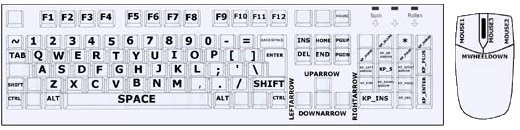
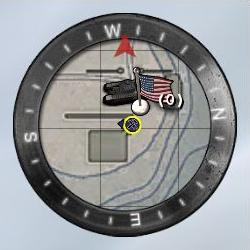
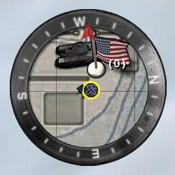
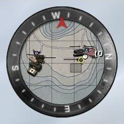
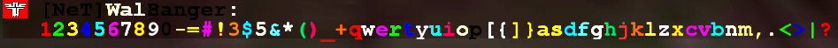

# Scripting and Config-Tuning for Wolfenstein : Enemy Territory

This tutorial is dealing with (hopefully) useful scripts for the Multiplayer Online Game "Wolfenstein : Enemy Territory". Developed by Splashdamage.

Many of the scripts included in this tutorial are not written by myself. They have been collected from various sources all over the internet like Forum posts, websites and the IRC. My part in this was to collect these scripts, writing explanations, more text and to put them into a structure. Yet, some scripts are also written by myself. As much as possible I have mentioned my sources and more links to the topic of scripting for ET at the end of this tutorial.

The tutorial consists of several parts. In the beginning you will find some basic explanations and a little FAQ. Then we move on to useful Scripts and a number of various commands, coloured names and speech-commands in the end.  

# Menu

- [Basics / FAQ](#basics--faq)
- [Some basic explanations and definitions](#some-basic-explanations-and-definitions)
- [Useful Scripts](#useful-scripts)
- [Namesettings and Colors](#namesettings-and-colors)
- [Speech-Commands](#speech-commands)
- [Sources and Links](#sources-and-links) _Note: These have been dead for as long as 16 years now!_


#
## Basics / FAQ

**Question :** What is a config ?  
**Answer :** A config is a .cfg file. It includes commands and settings that can be executed by ET.  
ET is automatically creating a config for every player-profile that you create, but we will use an additional config.

**Question :** Which tool is used to modify a config-file ?  
**Answer :** You may simply use WordPad or The Editor, both tools are already included in any standard Windows Installation.

**Question** : Which config-file has to be modified ?  
**Answer :** Using WordPad or the Editor you create a file in your etmain folder. Simply open WordPad / Editor and save an empty file with the name of autoexec.cfg to this folder :  
````c:\\Program Files\\Wolfenstein - Enemy Territory\\etmain\\autoexec.cfg````   
Make sure you don't save the file as a "text" file, the ending .cfg has to be correct.  
It's ok that this file is empty in the beginning, it's gonna be filled later with scripts and commands as you advance in this tutorial.

**Questions :** How do these scripts and commands get activated in a ET-Game ?  
**Answer :** Enemy Territory (ET) is automatically executing all commands in such an autoexec.cfg file in your etmain folder.  
There is also the possibility to manually execute .cfg files. While ET is running, open the console and type :  
/exec NameOfConfigFile.cfg  
Some settings get activated directly, other after a map-reload (when running config-files manually)

**Question :** How large may a config-file be ?  
**Answer :** It should not be larger than 16 kb. If your autoexec.cfg tends to be larger than this, create several .cfg files with different names. Add a line to your autoexec.cfg saying  
exec NameOfOtherConfigFile.cfg

**Question :** How are all these Keys on my Keyboard called that can be used to bind a command to them ?  
**Answer :** Check out this picture, it should be self-explanatory :  


**Question :** How can I use all the many buttons of a Logitech Mouse (like the MX500) ?  
**Answer :** You must have Mouseware 9.76 installed (or a higher version).  
If this is not enough, you may install a little patch from Logitech, here you find the download-link :  
http://www.game-foundation.com/files/logitech\_mousebuttons\_games.zip  
ET will recognise the Mousebuttons if you bind a mouse-button to a key like "F12" or "DEL" using your Logitech-Mouseware.  
I am not going to answer any further questions related to Mouses, please call the hotline of the Company that built your mouse or use google to find any further answers :)

**Question** **:** How can I undo a setting that I changed in my config-file ?  
**Answer :** It is not enough to just erase this setting from your config. Instead, you must put the standard-value for the certain option you want to have changed back. You can find out about the standard setting by using the console in ET.  
For example if you wanna find out the current value for r\_subdivisions and the standard value, go ahead like this :  
Open the console and type :  
/r\_subdivisions  
Then, you will see the value that r\_subdivisions has at the moment and also the standard value for it.

#
## Some basic explanations and definitions

If you just wanna use some scripts without understanding them on a deeper level, just go ahead and continue with the "Useful Scripts" section, and leave this part here out.

set, sets, seta are basically doing the same, they are defining a value for a variable.

**FPS** \- "Frames Per Second". If ET has 50 FPS on your computer, the computer is able to put out a new picture of the ingame-graphics 50 times per second. Some people say that 25 FPS means that the graphics are fluently and smooth since "a TV picture also consists of 25 Frames Per Second". It is true, a TV picture is created by 25 single pictures per second. But technically it is projected to the screen in another way than a 3D Computer Game. From 50 FPS onwards, imo you can talk about a fluent gaming experience in a 3D shooter. The more the better ;)

**Script** - A script consists of a number of commands that could also be used separately. In a script, for example it is defined that pressing a certain button causes several actions in the game, for example this makes it much easier to chose another class you want to spawn in and so on.

**Bind** - with the bind command, an action can be bind to a specific key, just like you define for example that by pressing Mousebutton 1 you shoot your gun in the normal options menu. In the scripts I mention later on, you will have to replace the "X" with a key that you prefer.

**Unbind** - a command to unbind a key. Do so by using the console in ET and typing in :  
````/unbind X````  
(use any other button instead of "X")

**Toggle** - with a toggle usually a switch between two values for a variable is bind to a key.

#
## Useful Scripts

Simply copy/paste the script you want to use to your autoexec.cfg and change the keybindings to suit your needs.

**Volume Script**  
With this volume-script you bind 2 keys that increase / decrease the volume during the game.  
````
//  
// Volume-Script  
//  
bind "." "vstr volup"  
bind "," "vstr voldown"  
set vol00 "set s\_volume 0.0;set voldown vstr vol00;set volup vstr vol01;echo Volume ^oO^0=========="  
set vol01 "set s\_volume 0.1;set voldown vstr vol00;set volup vstr vol02;echo Volume ^0=^oO^0========="  
set vol02 "set s\_volume 0.2;set voldown vstr vol01;set volup vstr vol03;echo Volume ^0==^oO^0========"  
set vol03 "set s\_volume 0.3;set voldown vstr vol02;set volup vstr vol04;echo Volume ^0===^oO^0======="  
set vol04 "set s\_volume 0.4;set voldown vstr vol03;set volup vstr vol05;echo Volume ^0====^oO^0======"  
set vol05 "set s\_volume 0.5;set voldown vstr vol04;set volup vstr vol06;echo Volume ^0=====^oO^0====="  
set vol06 "set s\_volume 0.6;set voldown vstr vol05;set volup vstr vol07;echo Volume ^0======^oO^0===="  
set vol07 "set s\_volume 0.7;set voldown vstr vol06;set volup vstr vol08;echo Volume ^0=======^oO^0==="  
set vol08 "set s\_volume 0.8;set voldown vstr vol07;set volup vstr vol09;echo Volume ^0========^oO^0=="  
set vol09 "set s\_volume 0.9;set voldown vstr vol08;set volup vstr vol10;echo Volume ^0=========^oO^0="  
set vol10 "set s\_volume 1.0;set voldown vstr vol09;set volup vstr vol10;echo Volume ^0==========^oO^0"  
set volup vstr vol05  
set voldown vstr vol05  
//  
````

**Stats/Topshots Script**  
By pressing a key, you can see your stats and your topshots at the same time. They stay on the screen until that key is pressed once again.  
````
//  
// Stats & Topshots Script  
//  
bind "X" "vstr statisticsall"  
set statisticsall "vstr statistics"  
set statistics "+topshots;+stats;set statisticsall vstr statistics2"  
set statistics2 "-topshots;-stats;set statisticsall vstr statistics"  
//
````

**Command-Map Script**  
Displays the command-map until the key is pressed again.  
````
//  
//Command map script  
//  
bind "X" "vstr map"  
set mapout "+mapexpand; set map vstr mapin"  
set mapin "-mapexpand; set map vstr mapout"  
set map "vstr mapout"  
//  
````

**Replay-Script**  
stops/starts a replay-recording by pressing a key. First key press Starts replay recording.  
````
//  
// Replay-Script  
//  
bind "F12" "vstr demotoggle"  
set demostart "set demotoggle vstr demostop; autorecord; echo ^0Record ^oON"  
set demostop "set demotoggle vstr demostart; stoprecord; echo ^0Record ^oOFF"  
set demotoggle "vstr demostop"  
//  
````

**Field Of Vision-Script**  
With 2 keys you can increase and decrease your fov between a value of 90 and 120 degrees.  
A fov of 120 is usually the highest that leagues and tournaments allow the players to use.
````
//  
// fov-Script  
//  
bind "X" "vstr fdn"  
bind "T" "vstr fup"  
set fdn vstr fov90  
set fup vstr fov95  
set fov90 "cg\_fov 90;set fdn vstr fov90;set fup vstr fov95;echo fov 90"  
set fov95 "cg\_fov 95;set fdn vstr fov90;set fup vstr fov100;echo fov 95"  
set fov100 "cg\_fov 100;set fdn vstr fov95;set fup vstr fov105;echo fov 100"  
set fov105 "cg\_fov 105;set fdn vstr fov100;set fup vstr fov110;echo fov 105"  
set fov110 "cg\_fov 110;set fdn vstr fov105;set fup vstr fov115;echo fov 110"  
set fov115 "cg\_fov 115;set fdn vstr fov110;set fup vstr fov120;echo fov 115"  
set fov120 "cg\_fov 120;set fdn vstr fov115;set fup vstr fov125;echo fov 120"  
//
````

**Alternative Field Of Vision- Script**  
Using the cycle command, you can switch the fov from 90 to 120 in steps of 5 degrees.  
You cannot decrease the fov with this script, but it starts with 90 again after you reach 120.  
````
//  
// alternatives fov-Script  
//  
bind "X" "cycle fov 90 120 5"  
//  
````

**Near/Far Toggle-Script**  
For a long range shooting players often use different settings than in a close-up infight.  
This script sets different values for your crosshair, fov, crosshairsize and your mouse-sensitivity.  
By pressing the key that you bind the script to, you can switch between the settings for long distance shootings and close up infights.  
Please note that you will have to customise the settings so that they suit you. The values included here are just meant to give an example of what the script is about.  
````
//  
// Near/Far Toggle-Script  
//  
bind "X" "vstr crosssensitoggle"  
set far "set crosssensitoggle vstr far;cg\_fov 90;cg\_drawcrosshair 5;cg\_crosshairsize 50;sensitivity 2.5"  
set near "set crosssensitoggle vstr near;cg\_fov 105;cg\_drawcrosshair 9;cg\_crosshairsize 70;sensitivity 4.5"  
set crosssensitoggle "vstr near"  
//
````

**Spawnpoint Script**  
This script uses 12 more little config-files. Download them and unzip them into your etmain folder :  
[http://www.net-clan.com/WolfWeb/spawn\_script.zip](http://www.net-clan.com/WolfWeb/spawn_script.zip)  
By pressing the defined keys you can select the map and the side (Axis or Allies) you are playing currently.  
After that you use another defined key to select the spawnpoint where you wanna spawn.  
Standard-Key for selecting the spawnpoint is "o" thats next to P. You must change that key in each of the 12 config-files to choose another key that suits you.  
The main part of this script as seen below has to be copied into your autoexec.cfg .  
````
//  
// Spawnpoint-Script (there are 12 more config-files that go along with this script !)  
//  
bind "i" "vstr maptoggle"  
SET maptoggle "vstr maptoggle1"  
SET maptoggle1 "exec al\_radar.cfg; set maptoggle vstr maptoggle2"  
SET maptoggle2 "exec al\_rail\_gun.cfg; set maptoggle vstr maptoggle3"  
SET maptoggle3 "exec al\_fuel\_dump.cfg; set maptoggle vstr maptoggle4"  
SET maptoggle4 "exec al\_oasis.cfg; set maptoggle vstr maptoggle5"  
SET maptoggle5 "exec al\_battery.cfg; set maptoggle vstr maptoggle6"  
SET maptoggle6 "exec al\_gold\_rush.cfg; set maptoggle vstr maptoggle7"  
SET maptoggle7 "exec ax\_radar.cfg; set maptoggle vstr maptoggle8"  
SET maptoggle8 "exec ax\_rail\_gun.cfg; set maptoggle vstr maptoggle9"  
SET maptoggle9 "exec ax\_fuel\_dump.cfg; set maptoggle vstr maptoggle10"  
SET maptoggle10 "exec ax\_oasis.cfg; set maptoggle vstr maptoggle11"  
SET maptoggle11 "exec ax\_battery.cfg; set maptoggle vstr maptoggle12"  
SET maptoggle12 "exec ax\_gold\_rush.cfg; set maptoggle vstr maptoggle1"  
//
````

**Class & Weapon Selection-Script**  
This script is done by [www.cowboyscripts.org](http://www.cowboyscripts.org) and has just been modified a little bit by me since the spawnpoint toggle that was originally included is not as comfortable as the one in the script above.  
Since this script here is rather long, you should save it in an extra config-file and add the line to your autoexec.cfg:  
````
//  
exec NameOfExtraConfig.cfg  
//  
````
In the User-Section of this Script there are altogether 10 keys defined so choose them carefully :)  
Attention : Before entering the game in a certain class, you must alway chose a side (Axis or Allies) which you want to play!  
````
//  
// Class & Weapon Section-Script  
//  
// ################################  
// ##### BEGIN USER SETTINGS SECTION #####  
// ################################  
//  
set quick\_pick "vstr br\_medic1"  
//  
// BINDS  
//  
set do\_bind\_quick\_pick "bind X vstr quick\_pick"  
set do\_bind\_sayclass "bind X vstr say\_class"  
set do\_bind\_team\_allies "bind X vstr set\_team\_b"  
set do\_bind\_team\_axis "bind X vstr set\_team\_r"  
set do\_bind\_team\_spec "bind X vstr set\_team\_s"  
//  
set do\_bind\_class\_select "bind X vstr br\_covert; bind X vstr br\_soldier; bind X vstr br\_fldops; bind X vstr br\_eng; bind X vstr br\_medic"  
//  
// #######################################  
// ##### END USER SETTINGS SECTION #####  
// #######################################  
//  
// TEAM SAY & SELECTION  
//  
set teamed\_true "set spawncycle "vstr set\_spawn0"; set spawnreset "vstr set\_spawn0"; vstr spawncycle; vstr set\_class; vstr say\_class; vstr reset\_cyclers"  
set teamed\_false "set spawncycle "vstr spawncycle\_s"; set spawnreset "vstr spawncycle\_s"; set set\_class "vstr set\_class\_s"; set say\_class "vstr say\_class\_s"; set say\_spawn "vstr say\_spawn\_s"; vstr reset\_cyclers"

set set\_team\_b "echo ^4\[^7Allies^4\]; set set\_class "vstr set\_class\_b"; set say\_class "vstr b\_class\_say"; vstr teamed\_true"  
set set\_team\_r "echo ^1\[^7Axis^1\]; set set\_class "vstr set\_class\_r"; set say\_class "vstr r\_class\_say"; vstr teamed\_true"

set set\_team\_s "echo ^2\[^7Spectator^2\]; vstr teamed\_false; team s"

set set\_class\_s "vstr play\_sound; vstr b\_class\_echo"  
set set\_class\_b "vstr play\_sound; vstr b\_team; vstr b\_class\_echo"  
set set\_class\_r "vstr play\_sound; vstr r\_team; vstr r\_class\_echo"

set say\_class\_s "echo You need to ^3choose a team^7 before your class can be announced!"  
//  
// CYCLE THRU CLASSES & LOADOUTS  
//  
set br\_covert1 "vstr b\_covert1; vstr r\_covert1; vstr set\_class; vstr reset\_cyclers; set br\_covert "vstr br\_covert2""  
set br\_covert2 "vstr b\_covert2; vstr r\_covert2; vstr set\_class; vstr reset\_cyclers; set br\_covert "vstr br\_covert3""  
set br\_covert3 "vstr b\_covert3; vstr r\_covert3; vstr set\_class; vstr reset\_cyclers; set br\_covert "vstr br\_covert1""

set br\_soldier1 "vstr b\_soldier1; vstr r\_soldier1; vstr set\_class; vstr reset\_cyclers; set br\_soldier "vstr br\_soldier2""  
set br\_soldier2 "vstr b\_soldier2; vstr r\_soldier2; vstr set\_class; vstr reset\_cyclers; set br\_soldier "vstr br\_soldier3""  
set br\_soldier3 "vstr b\_soldier3; vstr r\_soldier3; vstr set\_class; vstr reset\_cyclers; set br\_soldier "vstr br\_soldier4""  
set br\_soldier4 "vstr b\_soldier4; vstr r\_soldier4; vstr set\_class; vstr reset\_cyclers; set br\_soldier "vstr br\_soldier1""

set br\_fldops1 "vstr b\_fldops1; vstr r\_fldops1; vstr set\_class; vstr reset\_cyclers"

set br\_eng1 "vstr b\_eng1; vstr r\_eng1; vstr set\_class; vstr reset\_cyclers; set br\_eng "vstr br\_eng2""  
set br\_eng2 "vstr b\_eng2; vstr r\_eng2; vstr set\_class; vstr reset\_cyclers; set br\_eng "vstr br\_eng1""

set br\_medic1 "vstr b\_medic1; vstr r\_medic1; vstr set\_class; vstr reset\_cyclers"

set reset\_cyclers "set br\_covert "vstr br\_covert1"; set br\_soldier "vstr br\_soldier1"; set br\_fldops "vstr br\_fldops1"; set br\_eng "vstr  
br\_eng1"; set br\_medic "vstr br\_medic1""  
//  
// SET B (ALLIES) TEAM CLASS & LOADOUT  
//  
set b\_covert1 "set b\_team "team b 4 10"; set b\_class\_echo "echo ^5Covert Ops ^7with ^3Sten"; set b\_class\_say "say\_team ^5Covert Ops ^7with ^3Sten""  
set b\_covert2 "set b\_team "team b 4 33"; set b\_class\_echo "echo ^5Covert Ops ^7with ^3FG42"; set b\_class\_say "say\_team ^5Covert Ops ^7with ^3FG42""  
set b\_covert3 "set b\_team "team b 4 25"; set b\_class\_echo "echo ^5Covert Ops ^7with ^3K43"; set b\_class\_say "say\_team ^5Covert Ops ^7with ^3K43""

set b\_soldier1 "set b\_team "team b 0 31"; set b\_class\_echo "echo ^2Soldier ^7with ^3MG42"; set b\_class\_say "say\_team ^2Soldier ^7with ^3MG42""  
set b\_soldier2 "set b\_team "team b 0 6"; set b\_class\_echo "echo ^2Soldier ^7with ^3Flamethrower"; set b\_class\_say "say\_team ^2Soldier ^7with ^3Flamethrower""  
set b\_soldier3 "set b\_team "team b 0 5"; set b\_class\_echo "echo ^2Soldier ^7with ^3Panzerfaust"; set b\_class\_say "say\_team ^2Soldier ^7with ^3Panzerfaust""  
set b\_soldier4 "set b\_team "team b 0 35"; set b\_class\_echo "echo ^2Soldier ^7with ^3Mortar"; set b\_class\_say "say\_team ^2Soldier ^7with ^3Mortar""

set b\_fldops1 "set b\_team "team b 3 8"; set b\_class\_echo "echo ^8Field Ops ^7with ^3Thompson"; set b\_class\_say "say\_team ^8Field Ops ^7with ^3Thompson""

set b\_eng1 "set b\_team "team b 2 8"; set b\_class\_echo "echo ^6Engineer ^7with ^3Thompson"; set b\_class\_say "say\_team ^6Engineer ^7with ^3Thompson""  
set b\_eng2 "set b\_team "team b 2 24"; set b\_class\_echo "echo ^6Engineer ^7with ^3M1 Garand"; set b\_class\_say "say\_team ^6Engineer ^7with ^3M1 Garand""

set b\_medic1 "set b\_team "team b 1 8"; set b\_class\_echo "echo ^1Medic ^7with ^3Thompson"; set b\_class\_say "say\_team ^1Medic ^7with ^3Thompson""  
//  
// SET R (AXIS) TEAM CLASS & LOADOUT  
//  
set r\_covert1 "set r\_team "team r 4 10"; set r\_class\_echo "echo ^5Covert Ops ^7with ^3Sten"; set r\_class\_say "say\_team ^5Covert Ops ^7with ^3Sten""  
set r\_covert2 "set r\_team "team r 4 33"; set r\_class\_echo "echo ^5Covert Ops ^7with ^3FG42"; set r\_class\_say "say\_team ^5Covert Ops ^7with ^3FG42""  
set r\_covert3 "set r\_team "team r 4 32"; set r\_class\_echo "echo ^5Covert Ops ^7with ^3K43"; set r\_class\_say "say\_team ^5Covert Ops ^7with ^3K43""

set r\_soldier1 "set r\_team "team r 0 31"; set r\_class\_echo "echo ^2Soldier ^7with ^3MG42"; set r\_class\_say "say\_team ^2Soldier ^7with ^3MG42""  
set r\_soldier2 "set r\_team "team r 0 6"; set r\_class\_echo "echo ^2Soldier ^7with ^3Flamethrower"; set r\_class\_say "say\_team ^2Soldier ^7with ^3Flamethrower""  
set r\_soldier3 "set r\_team "team r 0 5"; set r\_class\_echo "echo ^2Soldier ^7with ^3Panzerfaust"; set r\_class\_say "say\_team ^2Soldier  
^7with ^3Panzerfaust""  
set r\_soldier4 "set r\_team "team r 0 35"; set r\_class\_echo "echo ^2Soldier ^7with ^3Mortar"; set r\_class\_say "say\_team ^2Soldier ^7with ^3Mortar""

set r\_fldops1 "set r\_team "team r 3 3"; set r\_class\_echo "echo ^8Field Ops ^7with ^3MP 40"; set r\_class\_say "say\_team ^8Field Ops ^7with ^3MP 40""

set r\_eng1 "set r\_team "team r 2 3"; set r\_class\_echo "echo ^6Engineer ^7with ^3MP 40"; set r\_class\_say "say\_team ^6Engineer ^7with ^3MP 40""  
set r\_eng2 "set r\_team "team r 2 23"; set r\_class\_echo "echo ^6Engineer ^7with ^3K43"; set r\_class\_say "say\_team ^6Engineer ^7with ^3K43""

set r\_medic1 "set r\_team "team r 1 3"; set r\_class\_echo "echo ^1Medic ^7with ^3MP 40"; set r\_class\_say "say\_team ^1Medic ^7with ^3MP 40""  
//  
// INIT CLASS CYCLERS, BINDS, DEFAULT LOADOUT  
//  
vstr teamed\_false  
vstr do\_bind\_sayclass  
vstr do\_bind\_quick\_pick  
vstr do\_bind\_team\_allies  
vstr do\_bind\_team\_axis  
vstr do\_bind\_team\_spec  
vstr do\_bind\_class\_select  
vstr do\_bind\_spawncycle  
vstr do\_bind\_spawnreset  
vstr do\_bind\_sayspawn  
echo "Choosing Quick-Pick Loadout:"  
vstr quick\_pick  
echo "^5Super^7-^5ET^7-^5Selector^7 ^51^7.^51^7 by ^3\]CkB\[^6Cowboy^7  
loaded!"  
//  
//This is the end of the Class & Weapon Selection-Script  
//  
````

**Namechange-Script**  
By using this script you can switch through 3 self-defined playernames.  
Normal Namescripts like in Q3 or RTCW have a little bug in ET so that no capital letters can be used. So this script is a little less elegant but at least it works :)  
Please create 3 extra config-files entitled name1.cfg, name2.cfg ans name3.cfg in your etmain folder and insert the line  
````seta name "MyNameVariation1"  ````
to name1.cfg and  
````seta name "MyNameVariation2"  ````
in the name2.cfg and  
````seta name "MyNameVariation3"  ````
to name3.cfg  
Choose names you prefer and course you may use the color codes that are mentioned later on in this tutorial.  
````
//  
// Namechange-Script  
//  
bind "X" "vstr namechange"  
set name1 "exec name1.cfg; set namechange vstr name2"  
set name2 "exec name2.cfg; set namechange vstr name3"  
set name3 "exec name3.cfg; set namechange vstr name1"  
set namechange "vstr name1"  
//  
````

**Direct Support Fire Script (only for Field Ops)**  
With this script, a Field Ops requests a support fire by pressing the defined key. It happens quite quick, so be sure that you have your crosshair pointing directly on your target since there is no phase anymore where you can choose a target through your binoculars.  
````
//  
// Direct Support Fire Script (only for Field Ops)  
//  
bind "X" "+zoom;+attack;-attack;-zoom"  
//  
````

**Hide or Show your Main Weapon Script**  
````
//  
// Hide or Show you Main Weapon Script  
//  
set Guntog1 "cg\_drawgun 0; set Guntog vstr Guntog2; echo ^0Gun Skin ^oOFF"  
set Guntog2 "cg\_drawgun 1; set Guntog vstr Guntog1; echo ^0Gun Skin ^oON"  
set Guntog "vstr Guntog2"  
bind T "vstr Guntog"
````

**Binocular-Script**  
With this script you can switch to binocular-sight and you only leave this sight again when the key is pressed again.  
````
//  
// Binocular-Script  
//  
bind "X" "vstr binocular"  
set bino\_on "+zoom; set binocular vstr bino\_off"  
set bino\_off "-zoom; set binocular vstr bino\_on"  
set binocular "vstr bino\_on"  
//
````

**Sniper-Script**  
This script is for lazy snipers that want to press one key to crouch and change to the zoom of the sniper. Press the key again to stand up and switch to normal sight.  
````
//  
// Sniper-Script  
//  
bind "X" "vstr nextsnipecrouchtoggle"  
set snipecrouch "+movedown; weapalt; set nextsnipecrouchtoggle vstr  
snipestand"  
set snipestand "-movedown; weapalt; set nextsnipecrouchtoggle vstr snipecrouch"  
set nextsnipecrouchtoggle "vstr snipecrouch"  
//
````

**Script to stay crouched**  
With this script a player can crouch and stay like this until the key is pressed again.
````
//  
// Script to stay crouched  
//  
bind "X" "vstr crouchswitch  
set duck "+movedown; set crouchswitch vstr stand"  
set stand "-movedown; set crouchswitch vstr duck"  
set crouchswitch "vstr duck"  
//
````

**Chat-Toggle**  
By pressing a key, you can switch off all global chat.  
Switch everything back to normal by pressing the button again.  
````
//  
// Teamchat-Toggle  
//  
bind "X" "toggle cg\_teamchatonly"  
//
````

**Suicide-Script**  
Not really a script but very useful : By pressing a key you commit suicide to be able to spawn in another class for example.  
````
//  
// Suicide-Script  
//  
bind "X" "kill"  
//
````

**Zoom Mini map in/out**  
````
bind x "mapzoomin" //zooms compass map in
bind z "mapzoomout" //zooms compass map out
````
  
_Default level of detail_  
  
_Zoomed in 2X clicks_  
  
_Zoomed out 2X clicks_

**Atmospheric Effects Toggle**  
````
// Atmospheric Effects Toggle  
// ---------------------------------------  
set atmtog1 "cg\_atmosphericeffects 0; set atmtog vstr atmtog2; echo ^0Atmospheric Effects ^oOFF"  
set atmtog2 "cg\_atmosphericeffects 1; set atmtog vstr atmtog1; echo ^0Atmospheric Effects ^oON"  
set atmtog "vstr atmtog2"  
bind X "vstr atmtog"
````

**Network Settings & more**  
````seta com\_hunkmegs "Wert"```` Defines how much RAM your PC reserves for ET. If you have 512 mb RAM, you can safely choose a value of 200.  

````seta com\_soundmegs "Wert"```` Defines, how much RAM your PC reserves for the sound of ET, 32 is ok if you have 512 mb RAM  

````seta cl\_timenudge "Wert"```` Default is "0" . Negative values are used to simulate lesserpings, but if you go too low you start lagging and see your opponents move no longer smoothly. Some leagues dont allow negative values at all, some up to -20. Positive values dont make sense at all, btw.  

````seta cl\_allowdownload "1/0"```` Defines if you get files from the server if your client doesn't have them (custom maps for example). default and recommended is "1". if The server wants to send you maps that are not running on it at the moment, try to set this to "0" and reconnect, sometimes this helps.

Network-Settings for Modem-Users (56k)  
````seta cl\_maxpackets "30"````  
````seta snaps "20"````  
````seta rate "5000"````

Network Settings for ISDN Users  
````seta cl\_maxpackets "60````  
````seta snaps "40"````  
````seta rate "7000"````  

Network Settings for DSL, Cable and other broadband connections  
````seta cl\_maxpackets "60"````  
````seta snaps "40"````  
````seta rate "25000"````  

#
## Namesettings and Colors

There is an easy to use program on the download section that is good or even better than this, if you would prefer to use that....

seta name "blaaaahhhh"  
with this command, you define your playername in the game. To add colours to it, use the color-codes below, the always start with ^

A coloured name would look like this for example :  
seta name "^2c^5o^8l^ko^pr^he^1d ^7Noob"

  

  
#
## Speech-Commands

There is the possibility to bind all the speech-commands from the quickchat menu to a key.  
Many players use this to have even faster access to certain speech-commands.  
There are 3 possibilities : speech can be heard by all players on the server or only by your Teammates.

Speech-Command to all people on the server :  
````
//  
bind "X" "vsay Sorry" // As an example, this will give out "Sorry"  
//
````

Speech-Command to all players in your team :  
````
//  
bind "X" "vsay\_team NeedEngineer" // As an example, this will give out "We need an Engineer"  
//
````

**VSAY list**  
Format: VSAY "In-Game Output"

PathCleared "Path cleared."  
EnemyWeak "The enemy is weakened."  
AllClear "All clear."  
Incoming "Incoming!"  
FireInTheHole "Fire in the hole!"  
OnDefense "I'm on defense."  
OnOffense "I'm attacking."  
TakingFire "Taking fire!"  
MinesCleared "Mines cleared."  
OnMyWay "On my way."  
NeedBackup "I need backup!"  
CoverMe "Cover me!"  
NeedEngineer "We need an engineer!"  
NeedOps "We need Covert Ops!"  
Medic "Medic!"  
NeedAmmo "I need ammo!"  
NeedTarget "I need a target!"  
WhereTo "Where to?"  
FollowMe "Follow me!"  
LetsGo "Let's go!"  
Move "Move!"  
ClearPath "Clear the path!"  
HoldFire "Hold fire!"  
DefendObjective "Defend our objective!"  
DisarmDynamite "Disarm the dynamite!"  
ClearMines "Clear the mines!"  
ReinforceDefense "Reinforce the defense!"  
ReinforceOffense "Reinforce the offense!"  
DestroyPrimary "Destroy the primary objective!"  
DestroySecondary "Destroy the secondary objective!"  
DestroyConstruction "Destroy the construction!"  
ObjectiveDestroyed "Objective destroyed!"  
RepairVehicle "Repair the vehicle!"  
DestroyVehicle "Destroy the vehicle!"  
EscortVehicle "Escort the vehicle!"  
FireOnTarget "Fire on my target!"  
CommandAcknowledged "Command acknowledged!"  
CommandDeclined "Command declined!"  
CommandCompleted "Command completed!"  
ConstructionCommencing "Construction underway!"  
ConstructionCompleted "Construction completed!"  
ConstructionDestroyed "Construction destroyed!"  
ObjectiveFailed "Objective failed!"  
ObjectiveCompleted "Objective completed!"  
Affirmative "Yes!"  
Negative "No!"  
Thanks "Thanks a lot!"  
Welcome "You're welcome."  
Oops "Oops!"  
Sorry "Sorry!"  
Hi "Hi!"  
Bye "Bye."  
Cheer "Yeah!"  
GreatShot "Great shot!"  
GoodGame "Good game!"  
IamSoldier "I'm a soldier."  
IamMedic "I'm a medic."  
IamEngineer "I'm an engineer."  
IamFieldOps "I'm a field ops."  
IamCovertOps "I'm a covert ops."  
FTMeetWaypoint "Meet at waypoint!"  
FTAttackWaypoint "Attack waypoint!"  
FTDefendWaypoint "Defend waypoint"  
FTAttack "Attack!"  
FTFallBack "Fall back!"  
FTCoverMe "Cover me!"  
FTCoveringFire "Soldier, covering fire!"  
FTMortar "Deploy mortar!"  
FTHealSquad "Heal the squad!"  
FTHealMe "Heal me!"  
FTReviveTeamMate "Revive team mate!"  
FTReviveMe "Revive me!"  
FTDestroyObjective "Destroy objective!"  
FTRepairObjective "Repair objective!"  
FTConstructObjective "Construct the objective!"  
FTDisarmDynamite "Disarm the dynamite!"  
FTDeployLandmines "Deploy landmines!"  
FTDisarmLandmines "Disarm landmines!"  
FTCallAirStrike "Call airstrike!"  
FTCallArtillery "Call artillery!"  
FTMortarBarrage "Call mortar barrage!"  
FTResupplySquad "Resupply squad!"  
FTResupplyMe "Resupply me!"  
FTExploreArea "Explore area!"  
FTExploreAtCoordinates "Explore at co-ordinates!"  
FTSatchelObjective "Destroy satchel objective!"  
FTInfiltrate "Infiltrate!"  
FTGoUndercover "Go undercover!"  
FTProvideSniperCover "Provide sniper cover!"  

#
## Sources and Links  
[  
](http://forum.ingame.de/wolfenstein/forumdisplay.php?s=&forumid=151)**planetwolfenstein.de Forum about Scripting : [http://forum.ingame.de/wolfenstein/forumdisplay.php?s=&forumid=151](http://forum.ingame.de/wolfenstein/forumdisplay.php?s=&forumid=151)

Wolfenstein 4 Dummies : [http://www.rtcwonline.com/dummies/](http://www.rtcwonline.com/dummies/)

Wolfstah.com, Australiian Wolfenstein Page : [http://www.wolfstah.com](http://www.wolfstah.com)

Cowboyscripts, (for the superselector) : [http://www.cowboyscripts.org/](http://www.cowboyscripts.org/)

Elite Force Tweak Guide : [http://mitglied.lycos.de/overbeck1/tweak/elite\_force\_tweak\_guide.htm](http://mitglied.lycos.de/overbeck1/tweak/elite_force_tweak_guide.htm%20)

High Boys's Home : [http://wolf.dehn.net/](http://wolf.dehn.net/%20)

Keens Q3 Engine Variablen : [http://www.gameadmins.com/modules.php?name=Keen\_Guide&op=variables](http://www.gameadmins.com/modules.php?name=Keen_Guide&op=variables%20)

Cultposting about the FPS and what this does to the DZM you can jump in the Quake 3 engine : :[  
http://ads.gamespy.com/hserver/SITE=Q3W/TIER=3/GENRE=ACTION/AREA=FORUM/AAMSZ=IAB\_FULL\_BANNER?unique](http://ads.gamespy.com/hserver/SITE=Q3W/TIER=3/GENRE=ACTION/AREA=FORUM/AAMSZ=IAB_FULL_BANNER?unique%20)

  
wolfenstein.ch good scripting forum  
[http://www.wolfenstein.ch/forum/board.php?boardid=23&sid=dfc5bed4408752dbcc527e2120e6ef91](http://www.wolfenstein.ch/forum/board.php?boardid=23&sid=dfc5bed4408752dbcc527e2120e6ef91)

target2002

Brain

Shorty