# Fire Team

## What's A Fire Team?

A fire team is a sub group within your overall team. You could create a fire team based on defenders, a specific class, friends ... it's up to you. When you belong to a fire team, there are some additional voice commands that are available and team mates are highlighted to make it easier to keep track of them in-screen and on the command map - adding to the level of coordination you can exercise in-game.

---

## The new HUD

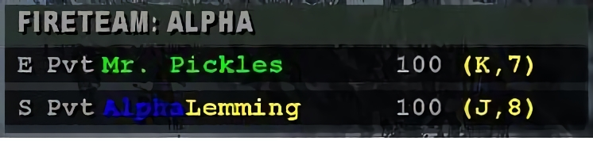  
The old HUD, showing the top 7 scorers, has been replaced with the fire team HUD. The HUD still gives the basic information, but tailored to the set of people you want to track. This way, you can create strike teams, watch a subset of defenders, or just coordinate amongst your buddies. The HUD shows class, rank, name, health, and the buddies grid coordiates.

For starters, make sure you have the a key bound to Fire Team Admin:

bind x "mp\_fireteamadmin"

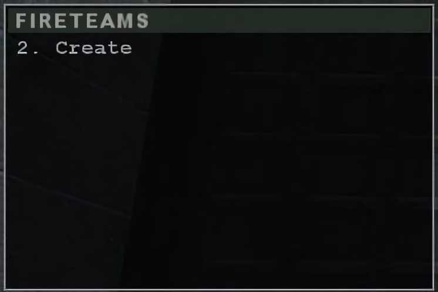

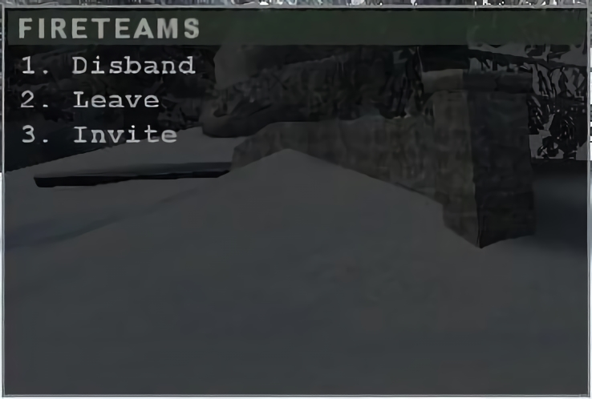

If you want to create a fire team, hit your fire team admin key and select create. You can even create a fire team just for yourself if you want.

Once a new fire team is created, you will now have options to disband, leave, or invite others. The fire team leader will be whichever person created the team


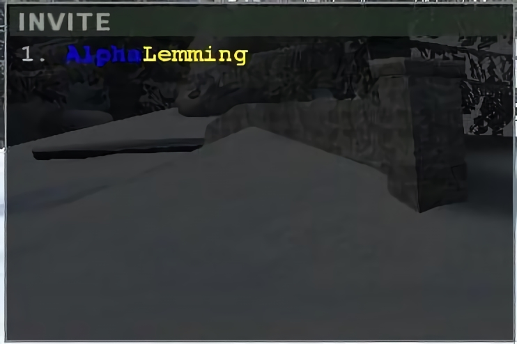

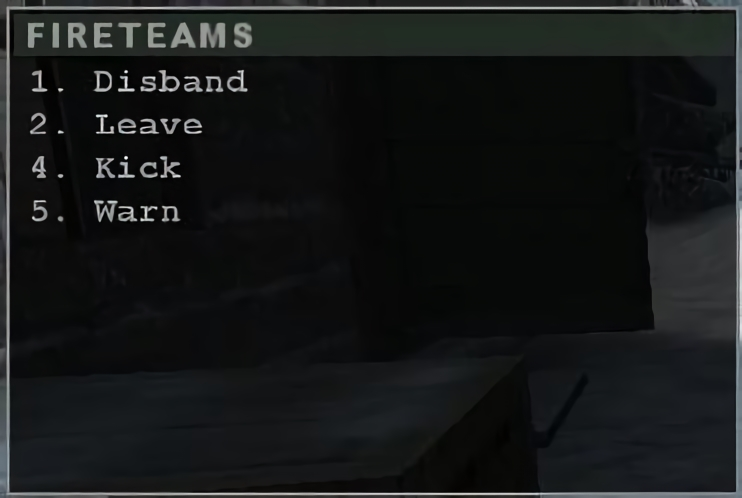

If you select invite, you will be presented with a list of name. Choose one.

When you have additional members of your fire team, you will be presented with additional admin options, to warn or kick a fire team member.


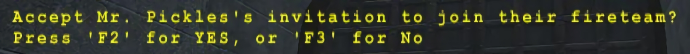

When you invite someone to join a fire team, they will get a notification and be asked to accept or decline. Once they've made a decision, you will get a return message telling you what they picked. If they accept, you will see their name added to your fire team HUD and the fire team HUD will pop up on their screen.


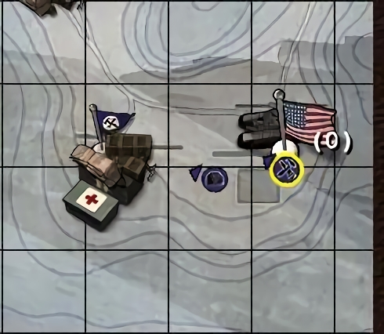

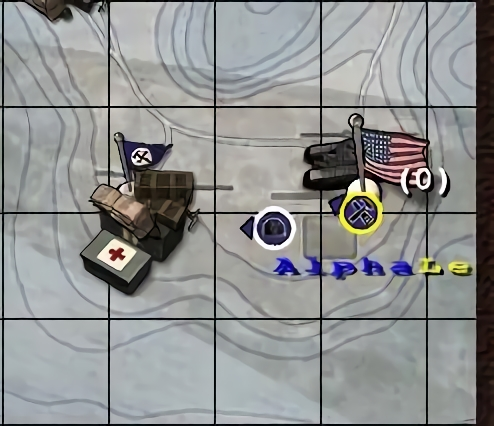

Fire team members are also marked differently on your command map for easier tracking. Non-team members show up plainly.

Members of your fire team, however, are marked with their name and a white circle around their icon.

When you join a fire team, you can also use the command:

`selectbuddy` (possible values of -2, -1, 1, 2, 3, 4, 5, or 6)

to show a fire team icon on top of the select buddy's head. To show the icon over ALL team members' heads, use the value -2. -1 turns the icons off, and 1-6 selectively add the icon only to specified buddies. This is particularly useful on dark maps and in thick vegetation. There are a total of 6 icons which correspond to the 6 possible fire teams that can be formed.

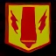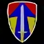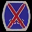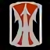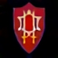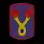

I've created a simple script to toggle the team icons on and off:

````text
//Fireteam script - toggles buddy team icons  
set showteam "selectbuddy -2; set nextteamtoggle vstr hideteam; echo Team Highlighted!!!"  
set hideteam "selectbuddy -1; set nextteamtoggle vstr showteam; echo Team icons hidden!!!"  
set nextteamtoggle "vstr showteam"  
bind x "vstr nextteamtoggle"
````
