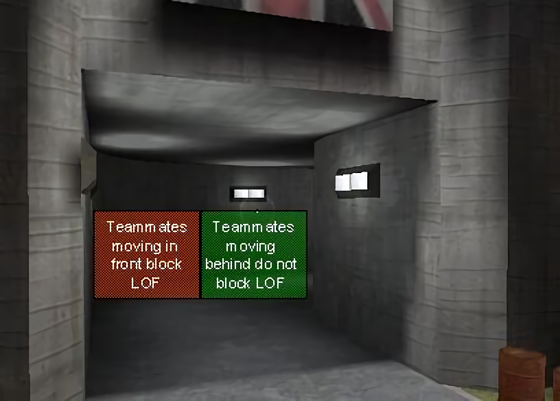
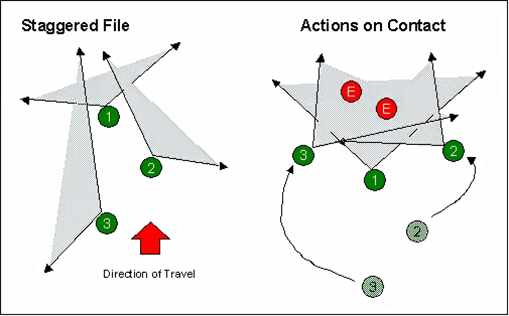
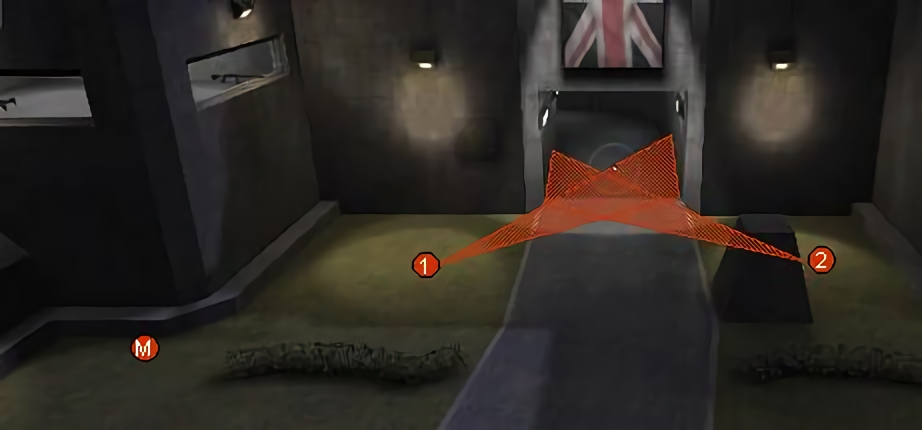

# Basic Team Techniques

- [Basic Team Techniques](#basic-team-techniques)
  - [Overview](#overview)
  - [Team Integrity](#team-integrity)
  - [Movement](#movement)
  - [Actions on contact](#actions-on-contact)
  - [Setting up interlocking fields of fire](#setting-up-interlocking-fields-of-fire)
  - [Working with other classes (Very Basic)](#working-with-other-classes-very-basic)

---

## Overview

For many people, RTCW is the first team-based FPS they've played. If you're like me, I've played a lot of FPS games, but mostly deathmatch or team deathmatch, nothing like the interdependent class-based system in RTCW. Teamwork is the key to success and many effective team techniques can be practiced with other people you haven't 'trained' with. It's a matter of everyone understanding some fundamentals and understanding what others are trying to do. What I'd like to do now is discuss some basic fire team (e.g., small teams of 2-4) concepts - not the entire Allied or Axis team, but techniques you can use with just one or two others.

---

## Team Integrity

- Never go anywhere by yourself. Individual players running around a map are too easy to pick off and it's hard to keep track of everything yourself.

- A coordinated team of two is more than twice as effective as a single person running around.

- If you're not leading a team, then follow someone else and stick to them. Watch where everyone runs off to upon respawn and if you see a player running off on their own, follow them (assuming they haven't proven themselves to be total jerks).

---

## Movement

- When traveling down corridors, don't stack up behind each other. People should be in a staggered file on opposite walls. If enemy contact is made, this lets the first 2-3 people shoot back and provides some spacing in case an enemy tosses a grenade. If you're in a single file, not only can you not shoot back, but also any enemy bullets that miss the lead man will probably hit someone in the middle of the file. Why make it easier for them?

- When traveling in more open areas, the staggered file still works but you probably want to have a little more space. A wedge with just a little more space keeps fields of fire open and the dispersion helps protect against artillery fire and air strikes. Also, having a few people trailing behind may give you a bit of a jump on any enemy who shoots at the pointman. They might not have seen the rest of the team before opening fire.

- Constantly look around, up, left and right, AND behind you. The team needs to stay aware of what's going on around them. You probably want to stop every now and then and just listen for what's going on.

  
_This should be familiar as the tunnel to No Man's Land on the Wizernes map. If people take up firing positions in the red zone, teammates are forced to cross in front of and will block their line of fire. Conversely, if people take up positions in the green zone, enough space is left behind them for teammates to move into No Man's Land without blocking LOF_

- When at all possible, do not cross in front of another person's line of fire. Try to pass behind them. Don't count on the other player recognizing that you're there and not shooting when you run in front of them. The corollary to this rule is that if you take up a firing position, make sure you leave space for people to pass behind you. If you can't, then it is your responsibility to watch out for friendlies that might block your line of fire.

- Don't crowd the doors. Nothing sucks more than running from fire only to find your exit blocked by someone standing in it. In fact, on beach, you'll often see me standing in the door at the top of the stairs by the breach, on the inside of the room, watching over the door from the axis spawn. That way I don't block the door, can shoot over the heads of people coming in, yet still suppress enemy reinforcements coming through the door. Also, it's harder for the enemy to see you when you're at the back of a room, vs. silhouetted in the doorway.

- If you're the last man in the column or wedge, look behind you every now and then. It's worth it to check your six periodically to make sure the bad people aren't sneaking up on you.

- The pointman also needs to turn around occasionally to see if anyone is still moving in the same direction as he is or even just to make sure the rest of the team is still there.

---

## Actions on contact

- When contact is made, not everyone should shoot back, just those with clean lines of fire (LOF). Anyone not engaging the enemy should 1) look for other enemies coming up the flank, 2) move into supporting positions where they can return fire, drop med packs, or provide ammo, or 3) look for opportunities to flank the enemy up front.

    

- Upon contact, the first 2 or 3 people with clear lines of fire should engage and try to move on-line with one another - meaning moving up so that your team forms a line - maximizing the amount of fire that can be delivered. Circle strafe left or right so that your wedge expands into a pocket that envelopes the enemy element. This accomplishes 2 goals 1), opens up LOF for people behind you and 2) sets up a cross fire on the target. Typically, people try to dodge left or right. If you are shooting at a target along two axis of movement, then the target is always dodging towards/away from one of the shooters, making it easier for one of you to hit.

    _In this example, we have a three man team moving in a staggered file, each with an assigned zone to watch. Once contact is made, the point man immediately returns fire. The trailing two men, move on line and establish interlocking fires on the two enemy soldiers_

- The key is to gang up on the opposition wherever possible. If my team of 2 runs into another team of 2, I'll often make sure I'm shooting at the same guy as my partner, even if I'm taking fire from the other guy. The faster we put one down, the faster we can turn both guns on #2

- If you can find a way to flank the enemy, do so. This could mean moving on-line as I just mentioned, or backing off a bit and finding another route to a position from which you can start firing at the enemies sides. Make sure that the rest of your element knows what you're doing because they may have to cover you and you don't want them to start pulling back while you're off sneaking around.

- If you have to retreat from a position, grenades are good tools to buy some time. If possible, the second person closest to the enemy should toss the grenade so that the closest person can keep up a stream of fire. Once the grenade is tossed, the #2 man runs back to take up a position where he can cover the withdrawal of the #1 man.

- Once the firefight is over, establish security and begin stocking up on health and ammo. One person should always be watching while the others stock up on ammo, health, and reload. Lieutenants and medics should go to the person on security to deliver ammo and health to him. As people get topped off, they should take up security positions. This improves the overall security of the team and signals to the LTs and medics that you don't need any more assistance.

---

## Setting up interlocking fields of fire

  
_In this illustration, I've set up a blocking team of 2 shooters and a medic. Their job is to prevent Allied entry into No Man's Land. Both gunners are shooting diagonally into the tunnel and have nice interlocking fires at the mouth of the tunnel. Neither is shooting directly at the other. A medic stands by in cover to pick up any Allied soldiers who might get through and to patch up any damage either of the two shooters might take._

- Setting up effective crossfires with a little bit of depth and support are extremely effective. On a map like Assault, the Allied team can effectively bottle the Axis team inside the rear Axis spawn point because they can concentrate a large amount of firepower on a small exit door while Axis return fire is minimized by the same constricting door. The Allied team can direct all of their fire on Axis soldiers emerging one at a time from the spawn point.

- Ideally, no friendly player sets up directly in front of the engagement area. If the enemy is moving properly, this allows them to concentrate their return fire on you, before the rest of your team engages them fully. You actually want to direct fire into their flanks.

- Firing from the flanks accomplishes 2 things, 1) the enemy has to turn from their direction of movement to deal with you and 2) by turning, their fire is split while your fire is still concentrated on them which improves your survivability.
- Be careful not to set up in such a way that a friendly person is in your cone of fire.

- If you have a third person on the team, let them pick up leakers, or enemy who make it through your interlocking fire. You'll have to trust that the forward element has wounded them enough so that the floating man can take care of the leakers. A medic is a good choice for a floater since he can also move forward and supply med packs to the wounded.

---

## Working with other classes (Very Basic)

I'm only going to offer very basic tips about working with other classes. There is too much to write about to discuss any particular class in detail. I do recommend that you take a few turns playing each of the other classes so that you gain a better understanding of where they might need support.

- **Engineers**. Often times the engineer's mission is to blow a game critical objective. Protecting the engineer often makes the difference between winning the game and losing the game. Protect the engineer by:
  - Giving him room to work. Don't stand between him and the objective he's trying to blow so that you can watch.
  - Do take up a covering position where you can pick up and engage any enemies coming in to stop the engineer.
  - Once the dynamite has been successfully planted, DO NOT run away, the dynamite still has to be protected.
  - If the enemy comes out to disarm the dynamite, prioritize your fire against the enemy engineers. If you kill them all, your engineers' mission was a success, regardless of how many other enemy soldiers are still standing around.

- **Medics**. Medics are the life blood of a team. They provide critical sustainability so that a team isn't constantly losing people to the respawn point and your team doesn't lose valuable time moving from the spawn point to the front lines. Make their job of healing you easier by:
  - Covering the medic while they go to revive fallen comrades. Often, the fallen are out in the open and the medic will need some covering fire while they sprint out to the fallen and get them back on their feet.
  - Giving them room to work and not getting in their way
  - As the fallen comrade, don't limbo out immediately. Look around to see if there is a medic around who can get to you. When the respawn timer is about to run out, tap out and then respawn. Please do not tap out when you see a medic running towards you. There's nothing more frustrating than braving enemy fire to reach a fallen buddy only to see them fade into the ground.
  - Also, be aware that once your revived, you won't be able to move for a couple of seconds. However, you can still shoot - this may give you an opportunity to provide some cover for the medic if he gets attacked while reviving you.
  - Once you're revived, get the hell back into cover so that I won't have to make a second trip out for you.
  - When being resupplied with health, there is no good reason why you need to face the medic. Take up a security position and let the medic hand med packs into your back.
  - Medics can hand out 4 med packs at full charge, no more. If a medic doesn't hand out a med pack when you ask, it may be that his charge meter is low. Don't constantly bug him.

- **Lieutenants**. Lieutenants are also critical to sustaining a team. They can also provide needed heavy firepower to harass, delay, and support. Help them out by:
  - Following the lieutenants and supporting them so that they stay alive long enough to provide you with ammunition.
  - When being resupplied with ammo, there is no good reason why you need to face the lieutenant. Take up a security position and let the LT hand ammo packs into your back. When you're topped off, move off so that the LT knows that you don't need any more.
  - Lieutenants can hand out 4 ammo packs at full charge, no more. If one doesn't hand out an ammo pack when you ask, it may be that his charge meter is low or he's conserving charge for air strikes (requires at least half a charge) and artillery (requires full charge). Don't constantly bug him.
  - Keep this in mind too, when the LT is running backwards and tossing out ammo packs, those 4 packs have to be shared with the rest of the team. Be careful not to take more than your fair share of ammo.

- **Soldiers**. Soldiers with heavy weapons fill very specific mission roles. Each heavy weapon is very useful for certain tasks, but also has its downsides. You have to appreciate how these weapons work and plan that into your interaction with the heavy weapons soldier. Help them out by:
  - Supporting soldiers with heavy weapons. They have specific missions in each game but are vulnerable if left to run around on their own. It's useful to have another player around to provide some cover fire as they get their heavy weapons ready (panzerfaust or venom cannon) or while they run around with the puny little pistols.
  - Providing security. They're probably pretty focused on a specific target and might miss the close by enemy approaching. It's your job to pick them up. Often times the heavy weapon will soften up a group of enemy enough where you can finish them off pretty easily.
  - Staying out of their way. Flamers and panzerfausts are area effect weapons. Give them room to work.
