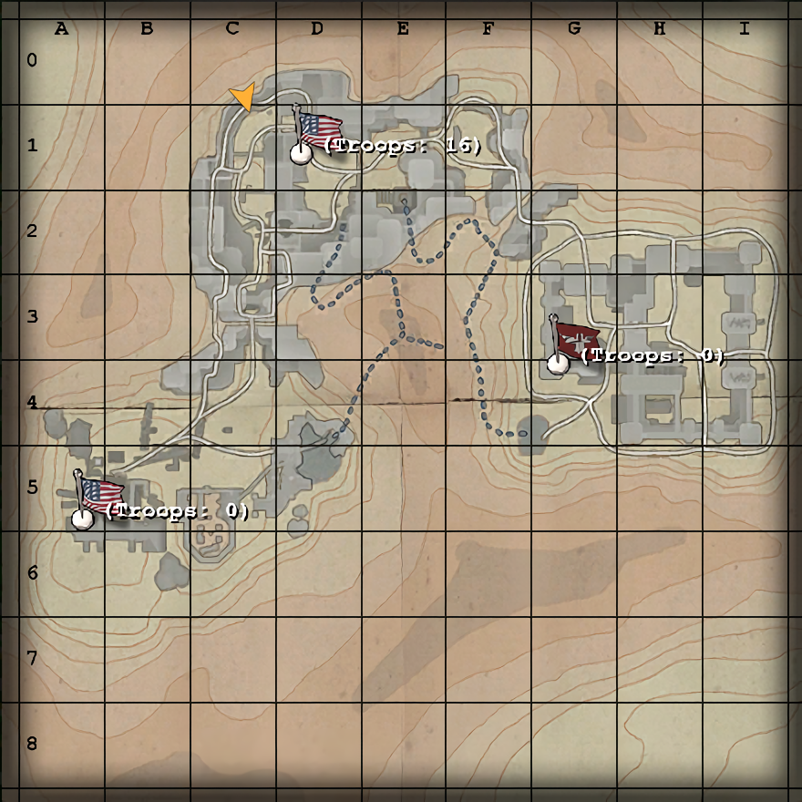

# Maps: Siwa Oasis

*Two mighty forces of elite fighting men clash in the desert for the possession of a vital oasis! The Axis has converted this sleepy desert town into a fearsome defensive bastion that has frustrated every Allied attempted advance! Can the Allies force their way into the heart of the Axis garrison and destroy their anti-tank guns? Can the Axis repel the swarming Allied attackers? Only time...will tell!*

—Briefing announcer

## Contents

- [Maps: Siwa Oasis](#maps-siwa-oasis)
  - [Contents](#contents)
  - [Allied Primary Objectives](#allied-primary-objectives)
  - [Allied Secondary Objectives](#allied-secondary-objectives)
  - [Map Description](#map-description)
  - [Constructables](#constructables)
    - [Axis](#axis)
    - [Allies](#allies)
  - [Points of Interest](#points-of-interest)
    - [Oasis Water Pump](#oasis-water-pump)
    - [Old City](#old-city)
    - [Old City Wall](#old-city-wall)
    - [Old City Water Pump](#old-city-water-pump)
  - [Axis Strategy](#axis-strategy)
  - [Allied Strategy](#allied-strategy)

## Allied Primary Objectives

- Capture the Old City.
- Dynamite the Old City Wall.
- Destroy the anti-tank guns.

## Allied Secondary Objectives

- Repair the water pumps.
- Construct the Command Post.

## Map Description

Siwa Oasis is a desert town with the Allies spawning in an area littered by ruins. Axis players penetrating the lines often try to camp amidst these ruins. Directly in front of the Allies spawn is a flooded cave with a water pump. An engineer who repairs this water pump can drain the caves, allowing players to pass through them without drowning.

With the Old City pump repaired, Allied soldiers can go from here...
The Allies have two other routes of attack - through some alleyways or by taking the stairs. The alleyway splits up and has two exits on opposite sides of each other, making it difficult for an Axis player to camp both entrances at the same time. The upper route leads past an Allied-only Command Post and directly above the alleyways.

Both routes dump into a street littered with ruins, giving players some cover. Players can continue north and then follow the stairs and reach the Old City spawn point, or dive into a building on the right (from the street) and then appear opposite to the Old City. Across from this area is a ladder leading down to the caves, and a ladder up to the rooftops of some of the buildings. Axis players like to hide in these areas for good cover and good view of the Allied Command Post. The Old City machine gun is on these rooftops.

...to here.
The Old City consists of two buildings - one containing the capturable spawn point and another containing a health and ammo cabinet. Moving further east is the Old City water pump and the Old City Wall. An Axis team door gives the Axis a way of disabling any dynamite planted near the Old City Wall. Another Axis route exists above the Old City wall, and an Axis team door allows Axis players to reach an area above the water pumps, giving them a chance of surprising Allied players in this otherwise safe area (e.g. with field ops dropping markers).

The first water pump the Allies must repair.
Past the Old City Wall is a large building with an upper route and a lower route. Both routes lead to the entrance of the Axis garrison, containing a spawn point just behind the garrison walls. The garrison is in a large pit surrounded by cliffs, and is separated in two parts - the Axis Spawn point area, and the section with the anti-tank guns. The two guns are positioned on the upper floor of the latter section, accessible primarily by stairs. These stairs can be bypassed by taking another route up the garrison (there are a few stairs leading up into it) and then taking the long way.

The section with the anti-tank guns is covered by a 360 degree machine gun, and a command post near the north anti-tank gun. The vulnerability of this machine gun, however, is quite apparent since any Allied players inside the garrison itself can easily come from behind and kill the machine gunner. Additionally there is a ladder leading right up behind the Axis gunner, making it easy to man the machine gun, but also very easy to access for the enemy.

## Constructables

### Axis

Command Post:  
Located in a room just behind the North Anti-tank gun, this Axis-specific Command Post is often left unattended for most of the game. Since the Allies have their own command post, both sides can cancel each other's command posts out and result in a faster charge time for both sides. A single engineer should spawn here at the start of the match to build this and the Garrison MG, and then spawn at the Old City thenceforth to help with defence.

Garrison MG:  
Often built, but rarely used. This 360 degree machine gun is rather vulnerable. It is open from five areas - a ladder leading right behind the Axis gunner, the buildings from the back, and the three entrances into the base - one between the anti-tank guns, and two on the sides. This makes the Garrison MG pretty much a deathtrap to any players attempting to man it.

### Allies

Command Post:  
Identical to the Axis Command Post (see above) for pretty much all respects. Like the Axis command post, this can be left alone once built. Very few players will attempt to disable it.

Old City MG:  
Rarely built, but can provide support fire to the Old City. Especially useful to spawn kill any Axis players spawning out of the Old City, or for defending dynamite at the Old City Wall.

Water Pumps:  
These water pumps, when repaired by the Allied team, will drain a pair of flooded caves, opening a second route. The Axis can disable these by planting dynamite at them, but considering the pumps are very easily guarded, it is very difficult to disable them once they're online. The only exception, perhaps, is the Old City Water Pump, which can be disabled so long as the Old City spawn point is under Axis control.

## Points of Interest

### Oasis Water Pump

This water pump is easily built by the Allies and, due to the proximity of the Allied spawn, is difficult to disable by the Axis. Most players don't even try. Efforts are best concentrated on the Old City.

### Old City

This spawn often switches sides. It is enclosed in a building with two entrances - across the main streets, or through an alleyway. Since it is enclosed, a lot of close-quarters fights occur here - knives, flamethrowers, and grenades lobbed in from the outside all are effective.

### Old City Wall

This wall blocks passage to the Axis fortress and the anti-tank guns. The Allies must dynamite this wall to proceed further. Some players can try to hop across the wall by using a small platform on the left side of it, but the difficulty of using this platform varies from server to server.

### Old City Water Pump

This network of caves leads right to the Axis stronghold, and therefore, if the Axis focus all their efforts in defending the old city wall, they can neglect to defend the cave entrance. This can allow an engineer to bypass most of the Axis defences and go straight for the anti-tank guns.

## Axis Strategy

A single engineer should spawn at the Axis fortress and construct the machine gun and, most importantly, the Axis Command Post. This somewhat negates the Allies' Command Post, which is often built as it is right in one of the Allies' avenues of attack.

Everyone else should spawn in the Old City and defend it at all costs. Defences are best concentrated on the rooftops that can be reached by going across the Old City plaza, up the ladder, and then heading left. This provides a good view of the Allied Command Post and the upper route. The second place defences can be concentrated at on the steps that can be reached by taking the other route out of the Old City spawn and staying there. It is a little more vulnerable, but players here can cover both routes of attack - any Allied taking the upper or lower routes are vulnerable. Players who enjoy close quarters combat can enter either route and wreak havoc. It is best, however, that you stay away from the Allied Spawn - it is a wide and open area, and it is easy to get killed there.

If the Allies capture the Old City, any and all Axis players should immediately seek to recover it. Ideally it should be captured as your spawn time winds down - this allows you to reinforce the position immediately rather than wait for troops to come from the fortress and take the long route. Close quarters combat is effective in the old city, and engineers should consider mining the plaza area, the alleyway entrance, and the old city wall.

Once the Allies take the old city, you must defend the wall. Because the Allies can now spawn out of the Old City, don't expect this wall to stick around for very long. The only way you can truly defend the Old City Wall is by reclaiming the Old City itself - no easy feat.

With the Old City Wall down, the Allies can flood into the fortress proper. There are five entrances to the fortress - two from the north (one of which leads into the Axis spawn, two from the south (again, one of which leads into the Axis spawn area) and one from the east. The ones not leading into the Axis spawn are covered by the 360 degree Garrison MG. Players must now focus the defence on the anti-tank guns. The best places to defend the guns from are opposite to the steps leading into the gun itself (as most players walk up the stairs forwards, you can easily shoot them in the back this way), and on the other side of the anti-tank gun (as most players will immediately try to set some dynamite, you can stand in the space behind them and shoot).

Mines should be laid down appropriately, typically:

- near the staircases leading to the anti-tank guns, especially the south staircase
- along the south wall
- in the caves, near the exit.

This is the Axis final stand, so you must simply defend the anti-tank guns until the time runs out. Both guns must be destroyed for the Allies to win.

## Allied Strategy

The first step is to take the Old City. It is quite a long walk from the Oasis to the Old City, and you can count on a lot of Axis players to guard it. The Axis will guard the area with everything they have at first - mines, flamethrowers, and snipers on the rooftop area. Fight your way through the ruins or repair the water pump and take the other route. Do anything it takes to get the Old City and force the Axis to spawn from their main spawn, which is quite a ways away.

Taking the Old city makes it much easier to set some dynamite at the Old City Wall. There are three spots to watch for Axis players - the Axis team door on the left of the wall, the walkway above the wall, and the walkway above the water pump. The walkway above the water pump is sealed up by another Axis team door. While the dynamite ticks down, repair the water pump and open up the secondary route to the Axis encampment.

Breaching the Old City Wall opens the primary attack route. The two paths from here to the Axis encampment are the upper floor of the building now in front of you, or the lower route. Both routes lead to the same place - the northwestern corner of the fortress and near the Axis main spawn. The anti-tank guns are on the far side of the fortress.

Do everything you can to get into the anti-tank guns, and once you're in, set some dynamite to blow them up. Due to the vicinity of the Axis spawn, the number of people likely to camp the area for any Allied Engineers, and the difficulty to even get inside the Axis encampment, it is often best for Engineers to work in groups of two or more. They should also be accompanied by medics, as getting the Engineers into the anti-tank guns is the key to victory. Ideally you should try to plant dynamite at both guns simultaneously, and try and get at least one of them to explode.

Destroy the anti-tank guns to win the game.
