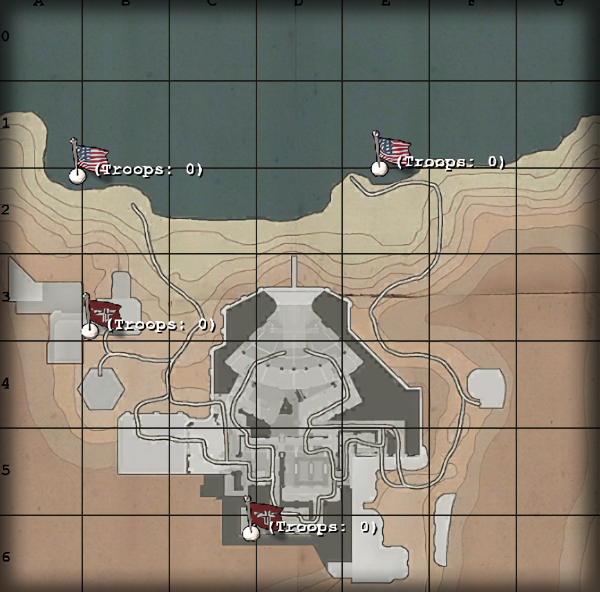

# Maps: Seawall Battery

*The Axis are guarding a glittering hoard of war booty locked tight within the vaults of Tobruk's imposing Central Bank! Can the Allies hijack an Axis tank and blast their way into the bank? Can the Axis repel these ram raiding khaki bank robbers? Yanks, Krauts, Tanks, Banks, Trucks, Gooold! What will be the outcome? Only time...will tell!*

—Briefing announcer

## Contents

- [Maps: Seawall Battery](#maps-seawall-battery)
  - [Contents](#contents)
  - [Allied Primary Objectives](#allied-primary-objectives)
  - [Allied Secondary Objectives](#allied-secondary-objectives)
  - [Map Description](#map-description)
  - [Constructables](#constructables)
    - [Axis](#axis)
    - [Allies](#allies)
  - [Points of Interest](#points-of-interest)
    - [West Bunker](#west-bunker)
    - [Magnetic Doors](#magnetic-doors)
    - [Rear Entrance](#rear-entrance)
    - [Gun Controls](#gun-controls)
  - [Axis Strategy](#axis-strategy)
  - [Allied Strategy](#allied-strategy)

## Allied Primary Objectives

- Construct the Assault Ramp
- Capture the West Bunker
- Destroy the Gun Controls

## Allied Secondary Objectives

- Destroy the Generator
- Construct the Command Post

## Map Description

On the coast of the Mediterranean lies the shore battery "Sigfried". Its imposing nature and massive cannon is the first thing the Allies will see from their spawn on the beach. They have two places at which to spawn - on the east and west sides of the beach. The Axis have no eastern beach spawn, but it is quite difficult to get into the battery this way.

The west attack route contains the aptly named West Bunker and the Assault Ramp. The Allies must charge their way up the beach, dodging airstrikes, artillery, and snipers, to reach the Assault Ramp construction zone. The assault ramp will allow the Allies to storm up the cliff and charge the West Bunker. The ramp can be destroyed by a satchel charge and is covered the Northwest MG nest.

The west bunker is mostly an empty room with an overlook onto the beach, giving the Axis good view of the Allies assault. Slightly beyond the beach are several rocks; Allied snipers favour these rocks as sniping spots. The battery prevents you from looking far upon the other Allied spawn. The West Bunker contains two machine guns - one on the main floor and one on the floor below, closer to the beach. Both are deathtraps, and the lower machine gun has a very narrow hallway, making it easily congested. At most only one player should be down there.

The trenches leading to the west bunker lead through several rooms, and then into a single long hallway with a machine gun nest at the end of it. The Axis spawn is to the left of the machine gun, on the second floor of the compound - the second machine gun overlooking the beach is to the right.

Back outside, there are a pair of steel doors blocking a route into the Axis compound. These doors can be opened or closed from the inside via a switch; they can also be disabled by destroying the generator on the eastern beach.

Speaking of the eastern beach, it is relatively unguarded, except for a single command post in a bunker. This area is often completely unguarded, because it is a complete dead-end for the Allies. It is blocked by a magnetic door, a team door, and a machine gun nest that is often unmanned. Behind the machine gun is the generator. If a Covert Ops manages to obtain an enemy uniform, they can use the team door and penetrate the facility. They can also open the team door for other teammates - an engineer, for instance, who can proceed to dynamite the gun controls unhindered.

There exists a variant of the map where the back door can be dynamited by an allied engineer. This really changes the dynamics of the game since it forces the Axis to guard the back door.

From here the Covert Ops can also satchel charge the Generator, opening the magnetic doors in four places - two protecting the gun controls, one at the rear entrance, and the last one by the West Bunker. The Axis must then rebuild the generator to close the doors.

The facility housing the gun battery is separated into three distinct parts - the rear, housing the generator, the Axis spawn area, and the gun battery. The battery area is a large empty room with the gun controls located in the middle. The catwalk behind the gun controls can be reached through some stairs or via a team door. The ground floor is protected by a pair of magnetic doors that can be opened from the inside. The team door leads outside to the Axis spawn, so it's of limited use for the Allies.

## Constructables

### Axis

Generator:
The Generator deals with the opening and closing of the magnetic doors around the Axis compound. If disabled by dynamite or a satchel charge, it forces all the magnetic doors to open, giving the Allies additional attack routes to the Gun Controls. The Axis should rebuild this if it gets destroyed.

Northwest MG Nest:
The Northwest MG Nest is quite powerful. Mounted in a room inside the compound, it can easily fire upon anyone who tries to make it up the Assault Ramp and into the West Bunker. Once the Allies capture the West Bunker though, it is relatively useless as it cannot aim low enough to shoot players in the trench.

Southeast MG Nest:
The Southeast MG Nest covers the back entrance. It is rarely built, and its operator will not see a lot of combat as it is rare that the Allies send a strike force through the back. However, a player manning this machine gun can easily put a stop to any sneak attacks from enemy covert ops and engineers.

Main Bunker MG Nest:
The Main Bunker MG Nest covers the long hallway that leads to and from the West Bunker. It can be quite powerful as the long hallway prevents players from manoeuvring out of the way. Its entrance is at the foot of the stairs from the Axis spawn.

### Allies

Assault Ramp:
The Assault Ramp is the key to the Allies attack up the beach. When constructed, the ramp allows Allied players to charge up the ramp and assault the West Bunker and the Gun Controls. Allied Engineers often are killed in droves as they attempt to construct the ramp, and even then it can be destroyed by a single satchel charge.

East Beach MG:
The East Beach MG is unfortunately quite useless as it is too far from the West Bunker to have any effect. It is practically a deathtrap and should be built as a solid barrier for snipers.

West Beach MG:
The West Beach MG is right in front of the Allies spawn point. It unfortunately is of limited use due to the huge number of Axis artillery and sniper fire. The Allies should construct it, but use it for cover. It can be used against any gutsy Axis players who dare to close the distance.

Command Post:
The Command Post is often left alone by both sides. Located near the Axis back door, it should be mostly ignored by the Axis. While the Axis can take advantage of it, it also presents the danger of having an Allied Covert Ops steal the engineer's uniform and then let a team through the back door. If the Allies construct the Command Post, it becomes a spawn point for them.

## Points of Interest

### West Bunker

The West Bunker is a large enclosed bunker with one machine gun on the main floor facing the assault ramp. Unfortunately it has a limited firing arc and as such it is rarely manned. There is a second machine gun at the beach level that is also rarely manned due to its limited firing arc in close quarters. It is reached by a ladder from the main floor leading down, and has a very narrow one-man hallway. It is best to leave this area mostly uninhabited as a result. It is very difficult to flee in the event of an emergency.

### Magnetic Doors

There are several grey metallic doors that block off certain areas of the compound. They can often be opened from the inside, but can be bypassed one way or another. They often serve to create chokepoints for the Axis to defend. Destroying the generator will open all the doors, but they can also be opened manually via switches.

### Rear Entrance

The rear entrance area consists of an indoor machine gun, a team door, a magnetic door next to it, and the generator. This area is important to defend for the Axis because the Allies can sneak their way into this area and destroy the Gun Controls very quickly.

### Gun Controls

The Gun Controls are located in the middle of a large room behind the barrel of the gun. It is protected on the ground floor by a pair of magnetic doors, but can be accessed from the top without hindrance to the Allies.

## Axis Strategy

The Axis have it easy at the start, but the farther the Allies penetrate the facility, the tougher it will be. The Axis have two spawn points - one in the barracks of the facility, and one is the West Bunker. Everyone should spawn at the West Bunker. If you wish to make the most of the Command Post, have your most skilled player spawn in the bunker, then work your way to the rear entrance and construct the command post. Then run like crazy back to the main entrance and make it through the team door. Ensure you didn't open the door for anyone by accident, then spawn at the West Bunker for the rest of the mission. If the Allies destroy the command post, do not rebuild it. It is much too risky to construct - the Allies will either find a dead end or a potential uniform. If they get a uniform, they can easily end the game.

Hold the enemy off at the West Bunker with airstrikes, artillery, and sniper fire (and maybe even a mortar firing at the assault ramp). Snipers should look on the rocks on the far side to find enemy snipers - there is very little place to hide. The Allies can throw marker flares up, but they often land too short to cause considerable damage, creating a large safe area behind them. Allied artillery strikes are useless since they can only be directed down, not up.

Axis players should take all necessary precautions to prevent the Allies from obtaining a uniform - do not use the back door under any circumstance, and do not descend to the Allies' level.

If the Allies manage to construct the assault ramp, a covert ops should immediately satchel it. The northwest machine gun will prove useful if the Allies construct the ramp - anyone running to the west bunker is a sitting target for it.

Ensure also that the Generator is always online. The generator not only controls the magnetic doors at the front, but also the magnetic door at the back. If the Generator is destroyed, the Allies can attack from the rear and from the West Bunker, strongly disadvantaging your team. Rebuild the generator as soon as possible.

If the Allies are unable to destroy the generator, they must make their way through the offices and into the line of the bunker MG. It should be able to hold off most Allied attacks on its own, and is your second line of defence. Expect a lot of smoke grenades to be thrown, as they can block the machine gun's view. Note that in front of the MG, the Allies can throw a switch that opens the magnetic door, even if the generator hasn't been destroyed. Ensure to close it if it is opened.

If Allied players manage to get past the machine gun, get the defences at the machine gun online while sending a team to secure the Gun Controls. Allied players often hide near the pillars close to the magnetic doors, shooting unaware Axis players as they attempt to defuse dynamite planted at the gun controls. Ensure to check both sides before defusing the dynamite.

Ensure the gun controls stay online for the duration of the match to win the game.

## Allied Strategy

Most of the team should start on the western beach. This location is heavily guarded, and most of the Axis will be spawning from the West Bunker in front of you. Expect a lot of marker flares, artillery strikes, and snipers.

Medics, Engineers, and Covert Ops are the three most valuable classes during the charge up the beach - medics should keep the team healthy and, most importantly, resurrect as many engineers as possible. The engineers should construct the Assault Ramp under the cover of Covert Ops smoke grenades. As soon as the Assault Ramp is constructed, charge up and immediately take the West Bunker, avoiding the Northwest Machine Gun as much as possible.

The East Beach is often unguarded, but a single Engineer can take the Command Post and have it help out a little. The rest of the time, it will rarely see action - if your team wishes to make the most of the back entrance, have a single Covert Ops stay behind and wait to see if an Axis Engineer will attempt to destroy the Command Post. Rarely ever will this happen, as the Axis know about the poorly defended rear entrance and will simply not come out of it.

Once the main team has secured the West Bunker, proceed into the facility to destroy the Gun Controls. The magnetic door near the Northwest Machine Gun is closed, but the offices directly in front of the West Bunker are open. After making your way through the offices - being wary of Axis players in the rooms above you (as there is a giant hole in one of them) you'll encounter the Bunker Machine Gun, which is quite hard to eliminate. The best way to neutralize it is to use a smoke grenade in front of the nest to have it shoot blindly, or not shoot at all. The rest of the team then must penetrate the defending Axis players and make it to the gun controls. An Allied player should try to open the magnetic door to create a new way in by using the switch.

From the long hallway of doom containing the machine gun, there are a few ways to get to the Gun Controls. Up the stairs and in the room with the beds is the Axis spawn, so don't go there. If you're running low on health, charge up the stairs past the spawn and into the control room on your right in the next area. It contains health and ammo cabinets.

Players who elect to remain on the lower floor can open the hatch in the floor to make their way into the lower area of the facility. After finding a twin set of stairs, take the left stairs and charge past the magnetic door to reach the gun controls. Be wary of Axis players hiding at the foot of the ladders near the doors, ready to surprise any Allied engineers. The gun controls are right in front of you. Destroy them to win the game.
