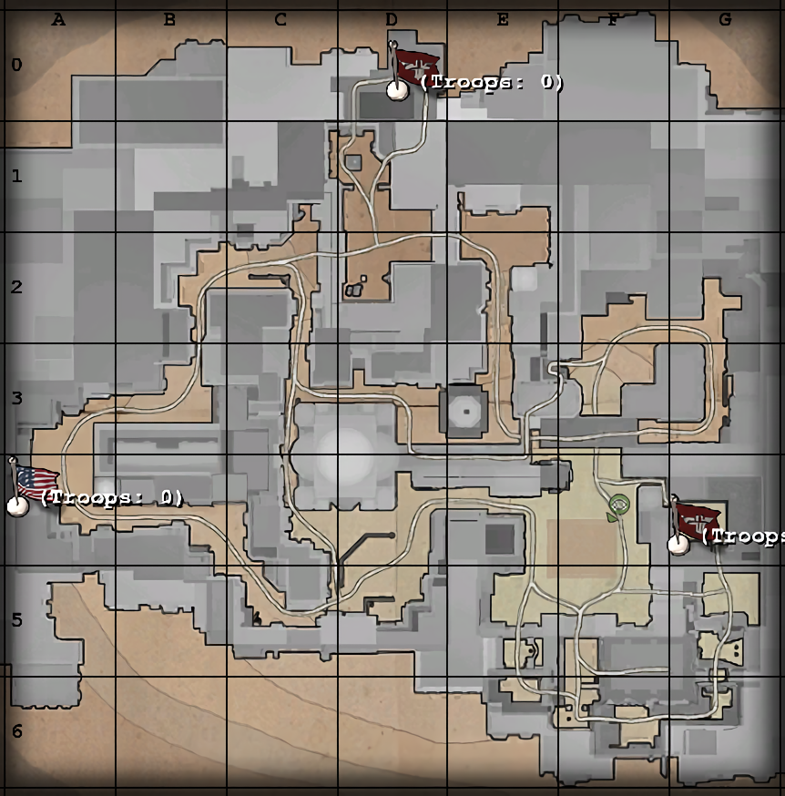

# Maps: Gold Rush

*The Axis have constructed a colossus: mounting a battleship gun in an impenetrable bunker, the Siegfried battery dominates the Mediterranean, and is terrorizing Allied shipping preventing all amphibious attempts to snatch Sicily and pressurize Italy. Can the Allied infantry silence Siegfried before their naval convoy hoves into range? Can the Axis hold the rampaging Allied raiders at bay until Siegfried can shatter their shipping? Only time...will tell!*

—Briefing announcer

## Contents

- [Maps: Gold Rush](#maps-gold-rush)
  - [Contents](#contents)
  - [Allied Primary Objectives](#allied-primary-objectives)
  - [Allied Secondary Objectives](#allied-secondary-objectives)
  - [Map Description](#map-description)
  - [Constructables](#constructables)
    - [Command Post](#command-post)
    - [Tank Barrier](#tank-barrier)
    - [Truck Barrier](#truck-barrier)
  - [Axis Strategy](#axis-strategy)
  - [Allied Strategy](#allied-strategy)

## Allied Primary Objectives

- Steal the tank
- Escort the tank past two tank barriers to the bank
- Grab the gold crates and load them onto the truck
- Escort the truck past two truck barriers to the exit

## Allied Secondary Objectives

- Construct the Command Post

## Map Description

The Axis are guarding a hoard of gold in the Tobruk Central Bank. The Allies must steal an Axis Jagdpanther to blow the bank open, steal the gold bars and drive them to safety in a Truck.

As can be inferred from the briefing announcer and the general map description, the Allies must retrieve some gold bars locked in a bank. The map is a large desert city at night. The Allies start near the western border. Charging west, towards the nearest Axis spawn, will allow the Allies to reach the tank they must steal in short order. The road then winds south, along a large street with few hiding spots. Overlooking the street is a walkway and several pillars that the Axis can use for hiding. From there, players can turn right and reach the yard with the tank, or left towards the bridge and the objective.

The bridge is sandwiched between the bank to the right and a machine gun to the left; the Allies may have a hard time getting the tank past this location. Rather than running across the bridge, however, players can make a shortcut through a building on the left, right before the bridge. This building has a ladder leading up to the walkway (which can also be accessed by some stairs on the far side) or down to the main street, right underneath the machine gun nest. Allied players can use this shortcut to get underneath the machine gun nest and kill players manning it.

The courtyard contains the primary Axis spawn point, a truck, and another machine gun nest opposite the Axis spawn. Allied players often will grab this nest and use it to kill Axis players as they get out of their spawn. The bank is completely inaccessible until the tank is escorted all the way to it. The tank then shoots a hole through the doors (which penetrates to the back, creating a back door to the bank), allowing Allied players to get inside.

Allied players must grab the gold bars sitting on the desk and get them to the truck waiting outside. The truck follows the side streets all the way to the original Allied spawn point, passing two constructable truck barriers along the way. Between the points is a large courtyard, on the left (coming from the Axis spawn) of which are some ammunition and health racks. Opposite is a balcony, a link to the back roads from the Allied spawn, and a path leading to the first tank barrier.

## Constructables

### Command Post

Opposite to the courtyard with the tank in it is a Command Post. Either team can build it. It is often left alone once built, however; there are many more pressing matters than the command post.

### Tank Barrier

Constructable only by the Axis team, the Tank Barriers prevent the tank from moving, even if it is at full health. For the tank to move past the barrier, the barrier must be destroyed and the tank be operable. There are two barriers; one near the road leading south, and another directly in front of the Axis primary spawn. Tank barriers can only be destroyed with dynamite.

### Truck Barrier

Constructable only by the Axis team, the Truck Barriers work in the exact same way the tank barriers do. They are a last-ditch effort by the Axis to prevent the Allies from escaping. The truck barriers have barbed wire on them, so players failing to jump over them will suffer light damage. Truck barriers can only by dynamited.

## Axis Strategy

The Axis ultimate goal is to let the time run out and not let the Allies make away with the gold. Focus all your defences around the Jagdpanther - defending it is relatively easy. Flamethrowers, airstrikes, and mines all work well. The primary avenue of attack the Allies must follow is a very narrow one, namely right by the doors. Very few, if any, Allied players will take the long way and come in through the back. Simply don't let any engineers through and you should be fine. Have one engineer, however, spawn at the lower courtyard and construct as many of the barriers as possible. The two tank barriers should have priority, although the first truck barrier can work too given it's nearby the Axis spawn. That engineer can also then use grenades to damage the truck and buy a few more seconds. Ensure to spawn near the tank, however, once the barriers are set up.

Field ops, soldiers, and engineers are the best choices on this map - field ops can use artillery or airstrikes on the tank to disable it very easily. Soldiers can use their flamethrowers and bipod machine guns to wipe out most Allied advances down the road (just be sure to watch your flanks). Engineers are necessity if the enemy manages to arm some dynamite. Failing to disable the dynamite isn't always the end of the barrier - especially if the tank is disabled. The barrier can be set up again if the tank is immobilized.

If the tank moves past the first barrier, field ops can throw marker flares up on the bridge to damage the tank further once it moves past the first barrier. Once it reaches the second, repeat the process. If you can stop the Allied advance for twenty or more minutes, you are in good shape.

If the Allies manage to break into the bank, defend the area with as many flamethrowers and machine guns as possible. Soldiers work well here. Medics and field ops make a good appearance too, allowing them to resurrect and resupply the soldiers whilst getting some kills of their own with their MP-40s. If the Allies manage to load the gold bars on the truck, however, the game is pretty much lost. A soldier with a panzerfaust can likely fire a rocket and disable the truck in short order to buy a few more seconds, but once the Allies have made it past the first barrier, passing the second is a no-brainer for them.

## Allied Strategy

The first objective is to steal the tank, which can be accomplished by fully repairing the tank and moving it a short distance. Considering an Axis spawn is right nearby, stealing the tank can prove difficult; the Axis can employ airstrikes, artillery, and landmines to kill any Allied engineers. Flamethrowers are another popular choice, considering the Allies must walk through a gap in a pair of large doors. Repairing the tank shouldn't take too long, however. Once the tank has been repaired, the spawn point switches sides, and becomes an Allied spawn point instead of an Axis one. It is not capturable by either the Allies (before the tank is stolen) or by the Axis (after the tank is stolen). A single engineer can now claim the command post for pretty much the rest of the game.

The tank will continue (so long as it hasn't been damaged) until it reaches the tank barrier. If the barrier is built, the tank will stop regardless of whether it is repaired or not. Ideally the Allied team will keep the tank repaired and use its machine gun to defend the dynamite used to destroy the tank barrier. Once the barrier is destroyed, the tank moves on.

Escorting the tank without any barriers is relatively easy. The next pivotal moment is the final tank barrier, which is just outside the Axis spawn. Some players spawn with a flamethrower and use it to kill Axis as they come out of their spawn, but don't forget an engineer is necessary to win the game. A similar set up from before works, although it can be more difficult given the proximity of the Axis spawn. It will likely take multiple tries to get the tank into the courtyard. Do not dawdle, however; time is on the Axis side, after all. The longer you wait, the less time you have to escape with the bars.

Once the tank is inside, it automatically shoots out the bank doors, allowing you (and them) access. The gold bars are located in the middle of a large room. Expect, however, Axis defenders to be right behind the walls, behind desks, and even on top of the gold bars. Flamethrowers are very popular here given the enclosed space, so sometimes it is best to simply have everyone charge the gold bars, grab them, and get them to the truck.

Beware that the courtyard may be mined, especially the area between the bank and the truck (yes, it is tempting to run straight through it once you have the bars!).

Once they are on the truck, it should be smooth sailing - the Axis must build the truck barriers, if they haven't already, but given how quickly the truck moves, the truck will be past the first barrier in almost no time. Once the truck is past the second barrier, there is nothing the Axis can do to stop the truck from escaping.
