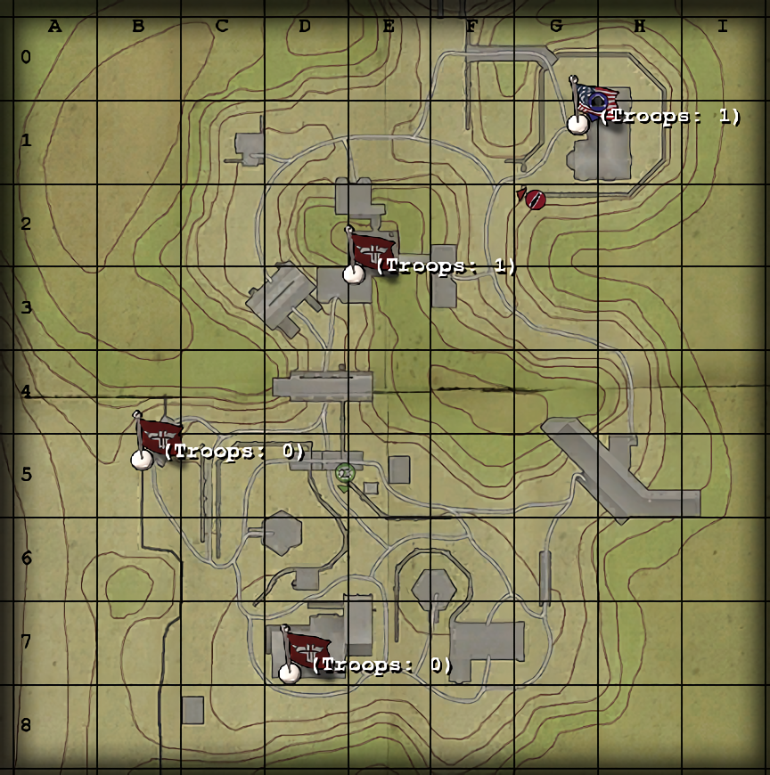

# Maps: Würzburg Radar

*Stunned by the Luftwaffe's humiliating failures to keep the Reich's skies free of Allied bombers, Axis scientists are developing new "radar" devices which could spell death to the Allied forces. The new Würzburg radar electronically detects and pinpoints Allied aircraft even on the darkest of nights! Can the Allies snatch these silent sky sentries electromechanical innards, and return them to their waiting egghead science maidens? Can the Axis beat back the frenzied Allied technology thieves? Only time...will tell!*

—Briefing announcer

## Contents

- [Maps: Würzburg Radar](#maps-würzburg-radar)
  - [Contents](#contents)
  - [Allied Primary Objectives](#allied-primary-objectives)
  - [Allied Secondary Objectives](#allied-secondary-objectives)
  - [Map Description](#map-description)
  - [Constructables](#constructables)
    - [Bunker Machine Gun](#bunker-machine-gun)
    - [Command Post](#command-post)
    - [(Axis) House Machine Gun](#axis-house-machine-gun)
    - [(Axis) Watchtower Machine Gun](#axis-watchtower-machine-gun)
  - [Points of Interest](#points-of-interest)
    - [Radar Sites](#radar-sites)
    - [Side Entrance](#side-entrance)
    - [Main Entrance](#main-entrance)
    - [Forward Bunker](#forward-bunker)
  - [Axis Strategy](#axis-strategy)
  - [Allied Strategy](#allied-strategy)

## Allied Primary Objectives

- Capture the Forward Bunker.
- Dynamite the Main Entrance.
- Secure the West and East Radar Parts and put them into the Escape Truck.

## Allied Secondary Objectives

- Dynamite the Side Entrance.
- Construct the Command Post.

## Map Description

Würzburg Radar is a dark and stormy map set in Europe. The Allies start in a small house with windows that can be punched out by gunfire or a knife. The house is enclosed by a wall, with two entrances - a direct way that leads near the Axis Forward Bunker, and a long tunnel which leads near the edge of the map. Taking the direct path, through the wooden gates, puts players in a grassy field with lots of undergrowth to hide behind. From here, Allied players can either continue on to assault the Forward Bunker from one of its two entrances, or continue past the entrance on the left to the Side Entrance, which can be dynamited open.

The Forward Bunker is a large, almost empty room with a capturable spawn in the middle. Expect a lot of close-quarters weapons - flamethrowers, grenades, maybe even knives - to be used in this area. The forward bunker is defended by a machine gun nest that guards the left exit. The streetside entrance of the Forward Bunker is unguarded.

The Forward Bunker, and the only road on the map, leads to the Main Entrance, beyond which is the Axis spawn and the radar components. The Axis can spawn in one of two areas - either in the central spawn, which is located inside a building near some crates, or in a smaller barracks to the side. The barracks is often a good place for Axis to spawn as it covers the Allied main route of attack from the main entrance.

The side entrance drops players in on the far side of the Axis encampment, away from the main spawns. It is guarded by a machine gun nest facing the entrance (often Axis-manned) and a Command Post. Near the Command Post is a ladder up to a second floor, where a team door is located. This is a one-way trip for Axis players to go through the Side Entrance area, but it prevents Allied players from reaching it until they've dynamited the Side Entrance.

The two Allied objectives are the twin radars which give the map its name. Attached to the radars are small boxes that can be picked up by Allied players. They must then be sent to the Allied Escape Truck, which can be seen just outside the main entrance. If the Axis are unable to prevent the Allies from loading the parts onto the truck, they will lose; the Allies need not escape with the parts, like in Gold Rush.

Also of note is a small house located down the road from the main entrance. It contains an Axis-specific machine gun and, most importantly, some health and ammo crates.

## Constructables

### Bunker Machine Gun  

This machine gun is useful for the Axis in guarding the Forward Bunker, but skilled players can swarm the machine gun or catch its operator by surprise easily. This machine gun can be satcheled or dynamited by an Allied Covert Ops or an Engineer once the Forward Bunker is taken for some Engineering/Covert Ops experience. An engineer can then rebuild the machine gun for even more engineering experience.

### Command Post  

Often built, but since it is often away from the fighting, it is often left alone. It is a good idea for the Axis to build this command post with a single engineer from the main spawn so that the Axis can take advantage of it before the Side Entrance is destroyed. Once the Side Entrance becomes available for the Allies, it can prove difficult to keep a hold of this Command Post.

### (Axis) House Machine Gun  

Often built, but rarely used because not many Allied players take the route it covers. Effort is more effectively spent defending the Forward Bunker.

### (Axis) Watchtower Machine Gun  

Potentially deadly, but its very limited fire arc precludes its use for the most part. Its operator is also vulnerable to attacks from the Side Entrance, so this machine gun is often built, but not manned.

## Points of Interest

### Radar Sites

The two radar sites which give this map its name are located beyond the Side and Main entrances. Attached to them are small boxes which are the targets of the Allied raids. When a radar part is stolen the radar will fold up. There are three ramps leading up from the ground to the radar site's base, so this can give Axis players a place to put some mines down.

### Side Entrance

A ground level door that can't be opened, the Side Entrance can be dynamited open. Dynamiting the Side Entrance opens up a second route for the Allies to attack the Radar parts from. Axis players can use the ladder next to the command post to go through the Side Entrance without having to dynamite it.

### Main Entrance

The main entrance is the large door right next to the escape truck. The nearby team door allows Axis or disguised Allied players to travel to and from the main encampment and the forward bunker.

### Forward Bunker

The Forward Bunker is a capturable spawn in, obviously, a bunker. The allies can spawn out of it while it is under their control, and it permanently falls under their control if they destroy the main entrance.

## Axis Strategy

The goal for the Axis - at least for now - is to hold the Forward Bunker for as long as possible. From here the Main entrance is protected and, to a lesser extent, the Side Entrance. If the Allies dynamite the side entrance the Axis must either let no Allies through it, or divide their forces to protect the radar parts and defend the forward bunker. It's much easier to simply protect the side entrance, though.

While a single engineer builds the command post, Engineers should look into mining the most important areas - the team door near the main entrance (which can be bypassed by the Allies by stealing a uniform), the ramps leading to the radar parts, and the entrances to the forward bunker.

Use close quarters weapons in the Forward Bunker and hold out as long as possible - hole the Allies up inside the house with artillery, airstrikes, and anything and everything that works. Mortars can also work to an extent.

If the Allies destroy the Main Entrance, the Forward Bunker becomes permanently theirs. The goal next is to, again, provoke a stalemate and create a large no man's land around what was once the main entrance while the rest of the team covers the side. Snipers can easily set up in the windowed area near the warehouse, and they can go prone for a quick escape down the water trough (though it's often more prudent to simply shoot any hostiles on the ladder).

Mines should be laid intelligently around the radars and in the paths leading from the side entrance, for instance, behind the vehicle hangar (incoming allies often sneak through or around the hangar).

There is often not much strategy for either team on this map - it is most often than not simply a question of holding ground for as long as possible.

## Allied Strategy

The first objective is to capture the Forward Bunker. While close quarters weapons like flamethrowers can really clear the bunker out in a hurry, Allied players must first traverse a large, relatively empty route that makes close-quarters players vulnerable to longer ranged attacks. The nearest entrance is also protected by a machine gun, so an engineer with a rifle grenade may be necessary to eliminate the operator.

If at all possible, head towards the Side Entrance and destroy it so your team can bypass the main entrance and attack the radar parts. This will force some Axis players on the defensive, allowing you to move in and secure the Forward Bunker. If the Axis continue to spawn from the Forward Bunker, your team can easily get their attention by capturing one of the radar components.

Once the Forward Bunker is secured, the next objective is to destroy the main entrance. If this entrance is destroyed, the Allies will take the Forward Bunker permanently. The most obvious attack route for the Axis is the team door to the side of the main entrance. Mining this area can prove effective, but keep in mind that sometimes Axis players can take the long way around and surprise your team from behind. Regardless, a few mines, coupled with maybe a machine gun pointed at the team door, is the best way to protect the dynamite.

The real challenge begins once the Main Entrance is destroyed. Axis players like to use airstrikes and artillery to create a large no man's land on their side of the main entrance, with most of the fighting occurring inside the main entrance itself. If the allies can't manage to get through the main entrance, try the side entrance. Continue to expect fierce resistance, however. Teams should be accompanied by a skilled medic who can eliminate Axis players with adrenaline, and revive any players who have fallen. A covert ops - or better, an engineer with the Flak Jacket upgrade - should report the landmines located near the radar parts. Disarming the mines takes too much time - it is often more prudent to simply have an engineer set off as many mines as possible, and then have the rest of the team move to grab the parts.

Getting out with the parts is harder than getting in, since once the Axis realize one of the parts is stolen they will scramble anyone and everyone to take it back. It's important to continue to move as a team, with the medic available to revive teammates in the event they die. Remember the Axis can return the parts if the player carrying them is killed, forcing you to start all over again. Don't let this happen and get the parts to the escape truck. Keep in mind you can use the side entrance for a longer, but arguably safer route, right through the now captured Forward Bunker spawn.
