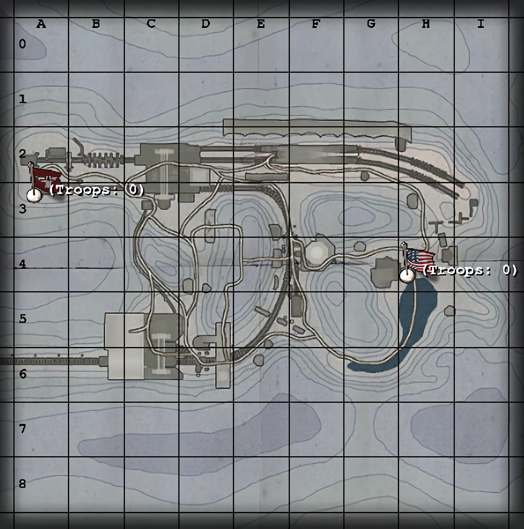

# Maps: Rail Gun

*The Axis has constructed a mighty iron behemoth: the massive Dora railway gun! Eighty centimetres in caliber, capable of hurling a seven ton shell thirty miles! If the Axis can fire Dora, the battlefront opposing them will crumble, and Axis dominance will be regained! To defeat the Axis dreams of domination the Allies must destroy devastating Dora, or look defeat in the face! Can the Axis load and fire the Dora rail gun in spite of fierce Allied attacks? Can the desperate Allies deny the Axis victory by striking Dora dumb? Only time...will tell!*

—Briefing announcer

## Contents

- [Maps: Rail Gun](#maps-rail-gun)
  - [Contents](#contents)
  - [Axis Primary Objectives](#axis-primary-objectives)
  - [Axis Secondary Objectives](#axis-secondary-objectives)
  - [Map Description](#map-description)
  - [Constructables](#constructables)
    - [(Allies) Track Switch MG](#allies-track-switch-mg)
    - [Depot Yard MG](#depot-yard-mg)
    - [Command Post](#command-post)
  - [Points of Interest](#points-of-interest)
    - [Depot Yard](#depot-yard)
    - [First Tug](#first-tug)
    - [Second Tug](#second-tug)
    - [Rail Gun](#rail-gun)
  - [Axis Strategy](#axis-strategy)
  - [Allied Strategy](#allied-strategy)

## Axis Primary Objectives

- Get the first tug to the depot yard and load Dora's ammo.
- Get the first tug back to the north crane, and transfer the ammo to the second tug.
- Move the second tug to the Dora rail gun.
- Fire Dora.

## Axis Secondary Objectives

- Construct the Command Post.
- Ensure the track switch does not impede your progress by raising or lowering it.

## Map Description

Railgun is a cold, snowy map. The Axis must get Dora's ammunition from the depot yard to Dora herself by way of a pair of tugs, then fire the railgun to win the map. The tugs move in an inverted C pattern, a half-circle. The primary Axis spawn is located at the north end of the C, and at the bottom, the depot yard and Dora's ammunition. The Allies spawn midway between the Depot Yard and the Axis main spawn, giving them a chance to intercept the first tug.

The track switch consists of a guard rail and a lever which can be pulled to lower or raise the switch. In order to keep the tug moving, the switch must be raised. The Axis, therefore, should try to raise the track switch to let it get from their main spawn to the Depot Yard, and then lower it to prevent the Allies from taking it all the way back to the main spawn in the event the person manning the tug is killed.

At the Axis main spawn is a second tug, which travels from the Axis main spawn to the railgun. The railgun takes up a large amount of the map, and stretches close to the Allied spawn point. This gives them a chance to guard the rail gun and prevent it from being fired.

From the Allied spawn, if one travels straight, right over the track switch, one can enter a small enclosed bunker-like area. A machine gun nest is perpendicular to the track, allowing someone to easily shoot someone out of the first tug as it passes by. Behind the machine gun is a neutral command post, which can be constructed by either side at any point in the game. This bunker is accessible from all three major points of interest - the Allied Spawn from the east, the Axis spawn from the north, and the Depot Yard from the south.

The Depot Yard itself contains a capturable spawn point. Contacting the flag will cause it to switch to your side. The depot yard spawn itself is quite open, and can be either protected by or attacked from a 360 degree machine gun nest just in front of it. The depot yard can be accessed by three ways - either via the tracks from the east, or two small valleys from the north and the northeast. Both valleys can be easily mined, and lead directly to the primary Axis Spawn. As a result, the Depot Yard is normally Axis-controlled upon the start of the match.

## Constructables

### (Allies) Track Switch MG

The Track Switch MG can be rather useful if it can be properly defended. It covers the track switch very well, and since its back is to the Allies main spawn, it is a little more secure than the Command Post machine gun. It remains, however, vulnerable from the Depot Yard, as well as potentially the Command Post machine gun. Regardless, the Track Switch MG can be useful by killing any Axis players escorting the tug, and when the tug gets closer, the tug driver.

### Depot Yard MG

The Depot Yard MG can be built by either team. The depot yard MG is a 360 degree machine gun positioned just outside the depot spawn point, and can be used to spawnkill enemies there, help out a melee for the spawnpoint from a distance, or cover one of the three entrances to the depot yard. it remains, however, very vulnerable since it can be approached from three sides - as such, it is often built but unmanned.

### Command Post

The Command Post is often taken by the Allies early in the game, but it can change sides very easily. Satchel charges are often your best bet in disabling the Command Post, since the map is relatively small and dynamite will often be defused. Dynamite can, however, attempt to draw some players away from a more important objective. The Command post can help out, but it is often left alone by most players and is rarely a determining factor in the map.

## Points of Interest

### Depot Yard

Contrary to initial belief, the depot yard does not determine the victor. Because the ammo is loaded onto the first tug regardless of who controls the yard, the first tug is more important. The Depot Yard becomes more important for the Allies if the Axis manage to load the ammo onto the first tug. They must then hold the Depot Yard and allow them to spawn there, and continue to defend the tug. If the tug leaves the depot yard, the Allies have one last chance to stop it from reaching the north crane at the track switch.

### First Tug

One of the crucial elements of the game is this tug. Because of its long and rather vulnerable path of travel (it must traverse the Allied spawn, two machine gun nests, and the track switch in order to reach the Depot Yard, and the same thing for the trip back), the Allies must keep the first tug from reaching the Depot as long as possible. Once the ammo is onto the second tug, it is very difficult to prevent it from reaching the rail gun.

### Second Tug

Very difficult to stop if the first tug reaches the depot yard and comes back with Dora's ammunition. The path is short and very straightforward.

### Rail Gun

Players initially playing the map will likely say something along the lines of, "Look at the size of that thing!" as they approach the railgun. Because of its huge size, it is very easy for both the Axis and the Allies to reach it. The rail gun itself is completely indestructible, but the major point of interest is on the side facing the Axis spawn - the gun controls. The last ditch effort by the Allies to win is by dynamiting the gun controls, requiring an engineer to traverse a relatively open area to repair the gun controls first, then fire the gun. Additionally, the rail gun itself has several nooks and crannies crafty players can slip into, to give any Axis engineers heck for repairing it. The gun controls are elevated on top of Dora and are reachable only by a ladder, and Axis players can expect this ladder to be heavily mined, or otherwise protected.

## Axis Strategy

The Axis have it relatively easy compared to the Allies on this map. The first objective is to get the first tug to the depot. The depot yard can be captured by sending a single person directly north. This person need only contact the flag in the depot yard to keep it as an Axis spawn. If this player is an engineer, the depot yard machine gun can also be built, and can prove effective against enemies so long as there are allies nearby.

The rest of the group, meanwhile, will likely engage the Allies right by the track switch. The switch is most likely heavily guarded, and will take a lot of fighting to get past it. Simple, no-hold combat is the best way to go here, but given the large number of players nearby flamethrowers can prove useful (so long as friendly fire is off). Other weapons are of limited use given the close quarters, although artillery strikes and marker flares can work effectively. If the Allies manage to get someone into the first tug, the tug will begin to move backwards. Someone only needs to get inside and use a knife on the driver to keep the tug moving in the direction of the depot.

Minor fighting can often be found inside, near the command post. Satchel charges and engineers may cause the command post to switch sides quickly, but guarding it isn't really a necessity. Focus on the objective - getting the first tug to the depot. Flamethrowers can work well in the command post, and as a result are popular among unskilled players seeking glory.

If the Allies have taken the depot yard already, you may find it difficult to get the first tug to the depot, given that a lot of Allies can spawn out of it. It is best, therefore, to capture the depot and raise the track switch, then bring the tug along. Getting the tug to the depot prompts the crane to load Dora's ammunition onto the first tug.

Your next objective is to get the first tug back to where it was before, and transfer Dora's ammunition to the second tug. The same strategy can apply as before, but securing the Depot Yard makes things much easier. Ideally you'll want half your team spawning from the original spawn and half your team spawning from the depot - as a result, you'll be able to keep the tug under constant guard as it makes its way back to the north crane.

Getting the first tug to the north crane allows the ammo to be transferred to the rail gun proper. Now the Allies will, from their original spawn, rush to secure the rail gun and prevent it from being fired. If an Allied engineer hasn't dynamited the gun controls yet, expect one to do so shortly. Escorting the second tug to the rail gun shouldn't be too hard given how the track is rather short and straightforward.

If the allies are mounting a last ditch defense of the railgun, expect mines in the "corridor" leading to the railgun ladder, as well as allies under and around the railgun, ready to kill incoming axis soldiers.

Once the rail gun is loaded by ammo from the second tug, simply repair the rail gun controls (if they have been destroyed already) and then press the use key on the rail gun controls to fire the rail gun and win the match.

## Allied Strategy

The three major points of interest at the start of the match for the Allies are the Depot Yard, the Track Switch, and the Command Post. Of the three the Command Post is the least useful, so send an engineer to build it while another team goes to capture the Depot Yard. Due to the shortcut the Axis have to the yard, however, the yard is often captured before the Allies can do anything about it. Focus therefore must be to prevent the Axis from passing the Track Switch. This can be accomplished by building the Track Switch MG, then taking out enemies as they come by. A single player then can hop into the tug (when the driver is killed) to push the tug back to the Axis spawn. This part of the game becomes a tug of war with tugs. Flamethrowers work quite well near the track switch and especially in the Command Post area. Send a single engineer to the rail gun controls and dynamite them to save some time.

The mission becomes somewhat more difficult if the Axis manage to load the ammo onto the first tug. Holding the Depot Yard then becomes your priority, as you must keep the tug there and not let it get to the second tug, where they'll transfer the ammo. Mines near the first tug at this point can often cause trouble for any Axis soldiers trying to get in, and sneakier Covert Ops can use Satchel Charges inside the tug - simply detonate it when the tug starts to move. The Depot Yard MG can provide some supporting fire if there are players around to help defend its gunner, and if the Axis attempt to take the Depot Yard for themselves, flamethrowers work well in the close quarters. The Depot Yard MG can help out as well, especially if Friendly Fire is turned off.

If the Axis escape with the tug, your last chance to intercept it is at the track switch.

In the event the Axis manage to transfer the ammo to the second tug, the Axis will then need to get the second tug to the railgun, build the gun controls (if you destroyed them earlier) and then hit the "Use" button on the rail gun to shoot the railgun and win the game. There is normally not much you can do about stopping the second tug from reaching the railgun, but you can defend the railgun for a few minutes by mining the base of the ladder players need to get up and hiding out in the nooks and crannies inside the gun itself. Ensure both a medic and a field ops is in that area, as having to respawn for ammo and health takes up precious time and manpower, especially when the game is so close to being lost.

If you have an eagle's eye, target any Axis engineers as first priority, since they're the only ones who can repair the gun controls AND fire the rail gun (the other classes can simply fire the gun). Keeping an Engineer handy to dynamite the gun controls at first opportunity, defend the gun controls until the time runs out to accomplish the mission.
