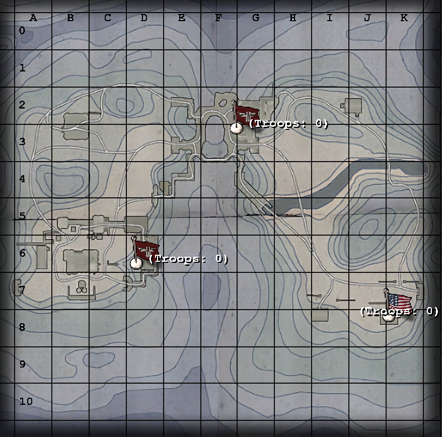

# Maps: Rail Gun

*Desperately short of supplies, the Axis are hoarding their fuel stocks for one final furious offensive! The Allies have located this hidden hoard of black gold and are determined to destroy it! Using a special assault tank they aim to blast their way through the Axis defences, and dynamite the Reich's final fuel facility to oblivion! Can the Allies' daring tracked attack succeed? Will the stout Axis defenders trounce the clanking Allied tank-tending trench-takers? Only time...will tell!*

—Briefing announcer

## Contents

- [Maps: Rail Gun](#maps-rail-gun)
  - [Contents](#contents)
  - [Allied Primary Objectives](#allied-primary-objectives)
  - [Allied Secondary Objectives](#allied-secondary-objectives)
  - [Map Description](#map-description)
  - [Constructables](#constructables)
    - [Neutral](#neutral)
      - [Side Machine Gun](#side-machine-gun)
    - [Axis](#axis)
      - [Axis Command Post](#axis-command-post)
      - [Tower Machine Gun](#tower-machine-gun)
      - [Depot Defences](#depot-defences)
    - [Allies](#allies)
      - [Bridge](#bridge)
      - [Footbridge](#footbridge)
      - [Road Machine Gun](#road-machine-gun)
      - [Command Post](#command-post)
  - [Points of Interest](#points-of-interest)
    - [Grate](#grate)
    - [Fuel Dump](#fuel-dump)
    - [Depot Side Wall](#depot-side-wall)
  - [Axis Strategy](#axis-strategy)
  - [Allied Strategy](#allied-strategy)

## Allied Primary Objectives

- Construct and reinforce the bridge.
- Escort the tank to the bunker doors.
- Escort the tank to the depot gate.
- Escort the tank to the rear of the depot.
- Dynamite the fuel dump.

## Allied Secondary Objectives

- Construct the command post.
- Construct the footbridge.
- Breach the depot defences.

## Map Description

Fuel Dump is a cold and snowy map set in Northern Europe, just like Rail Gun. The Allies start in a small house, and the Axis in a bunker set in a mountain.

The Axis can reach the battle quickly by finding one of the two exits to the spawn - one on the floor they spawn on, or a higher one up the stairs. Slight damage can be taken for the player who jumps off the upper stair, but players who take the lower route take reduced, if any, damage.

The Allies, meanwhile, start in a house with another house nearby, a tank, and two routes - one through a slightly wooded area in front of them, and a road on their left side. The road opens out to a large open area, a frozen stream, and a hill containing the Axis exits, a machine gun mounted on a tower, and an Axis Command Post.

The Allies must construct the bridge in order to continue. This is extremely difficult because Axis field ops can call artillery strikes around the bridge. Axis snipers also have a field day on the hill and to the side, near the Axis Command Post. The bridge must be constructed twice - once to start construction, the other to make it passable for the tank. The Axis can dynamite the bridge and damage it to prevent the Allies from proceeding.

The frozen stream is barbed wired, and the opposite bank is too high to cross, so the Allies must construct a footbridge by taking the wooded path from their spawn. Down the stream is a grate that can be destroyed by the tank. This new route leads behind the Axis spawn and, with the help of a Covert Ops, an Engineer can get past the Axis spawn and dynamite the fuel dump immediately.

If the tank manages to cross the bridge, it must be escorted to the doors down the road. Once the doors are no more, the bunker spawn switches sides from Axis to Allies for the rest of the game. The Axis must spawn out of the fuel dump now.

The Allies have three routes to attack the fuel dump - the closest route from their new spawn leads far away from the depot, behind a hill, and near a garage with a command post. Snipers like positioning themselves on the hill and sniping down on the depot.

The second route is the most exposed route, but is the route the tank takes to get to the depot gates. The tank can then breach the depot gates, allowing the Allies access. Note the team door next to the depot gates - this is the main Axis route in and out of the base. This is the team door that must be bypassed by a disguised Covert Ops to allow an Engineer into the fuel dump.

The final route leads to the foot of the Axis base, near the depot gates.

The depot itself consists of a single large building and a bunker inside the mountain. The Axis spawn inside this mountain. The fuel dump is located on the far side of the large building. The building has a team door on the upper floor that lets Axis players to the roof. From here they can snipe down on advancing Allies. Allied players can use this to their advantage by taking the team door, but can jump down upon the fuel dump and dynamite it from the inside, bypassing the two fences that the Axis build to defend the dump.

## Constructables

### Neutral

#### Side Machine Gun

If the Axis build this, the machine gun covers two of the three Allied entrances to the fuel depot. It is mounted on a tower, making it quite hard to get past. If the Allies build it, however, it has a view of the depot gates in a much simpler sandbag protected machine gun.

### Axis

#### Axis Command Post

Located in a house on the Axis side of the river, this is rarely built, but should be used. It is quite secure and lets the Axis have an even bigger advantage over the Allies.

#### Tower Machine Gun

The Axis can build this machine gun located in a watch tower. The machine gun is rarely used due to its inaccuracy, but snipers can make use of the tower to snipe.

#### Depot Defences

The Depot defences are fences that protect the depot. There are no doors to the defences, and the only way for the Axis to get inside the depot once the defences are constructed is by way of the team door on the roof of the building.

### Allies

#### Bridge

The bridge lets the Allies move their tank to the depot gates. The bridge must be constructed, and then reinforced. Only a reinforced bridge can be traversed by the tank. It is often a good idea to have smoke grenades protect the Engineers constructing the bridge.

#### Footbridge

Often built, but rarely used. The Footbridge build box is a little more protected, but can let the Allies get in close and personal with Axis snipers. It can be easily destroyed, though, by a satchel charge.

#### Road Machine Gun

Often built, but rarely used considering the number of Axis snipers on the hills. It is often best used as cover.

#### Command Post

Build it as soon as you can. The Allies will need every advantage they can get for their assault. Constructing the Command Post will also construct health and ammo cabinets.

## Points of Interest

### Grate

The grate is located on the (from the Allies' perspective) left side of the frozen stream. It is automatically destroyed by the tank when it gets close to the bridge. The destruction of the grate allows players to get behind the Axis spawn and reach the fuel dump gate without having to get the tank there. If a covert ops has a stolen uniform, he can let an engineer into the dump and dynamite it. If the depot defences are built, they can either be bypassed by going to the roof, or by using satchel charges on the fences.

### Fuel Dump

The fuel dump itself contains three large tanks of fuel and a ladder on top. Dynamite can be wedged in between the tanks, or on top, to make it more difficult to defuse.

### Depot Side Wall

The Depot Side Wall can be destroyed by the Allies tank, allowing another route into the Axis garrison. This is often a more secure way of entering the base because it is less open, but both paths are heavily fortified.

## Axis Strategy

The Axis must first defend the bridge construction box. So long as there are no Allied engineers near it, the bridge can't be built. Use Field Ops artillery strikes on top of the box to take out any engineers trying to build the bridge, and snipers for some cover fire. Since this first area is wide open, there will be a lot of snipers on the other side of the river. Look in particular in the trees near the footbridge and by the Allied machine gun. Snipers should target in particular enemy Covert Ops, since they can steal a uniform and run with an engineer straight to the fuel dump.

This is also a pretty good map with mortars, as there aren't a lot of places to hide. Mortars also work well against the tank, as well as near the bridge construction box. Ensure a field ops is nearby though to resupply the mortars, as using them is often a guessing game.

In the meantime, a single engineer should construct the Command Post and the machine gun. The machine gun, while a deathtrap for anyone trying to man it, can prove to be effective cover for snipers and other players. Ensure that the Covert Ops and Engineers in particular are eliminated, as together they can end the game very quickly for you. As Axis your goal is to prolong the game as long as possible.

It may be tempting to have an Axis Engineer spawn in the Fuel Dump and construct the depot defences. Note however that if the Allies manage to sneak a covert ops and/or an engineer into the fuel dump, then the covert op can open the roof door and thus bypass the defenses, while any engineer that you could spawn in the fuel dump in order to defuse the explosives will have to go the same route — which will probably be too long.

Mining the fuel dump (see below) should be a safer option, though any self-respecting covert op will scan the area with his binoculars prior to entering sneakily.

If the Allies manage to construct - or worse, reinforce - the bridge, a Field Ops must immediately damage the tank and prevent it from moving across the bridge. If this can be accomplished, the bridge can be dynamited, forcing the Allies to start over.

Speaking of bridges, keep a lookout on the Footbridge. The Allies have no business around it, so eliminate it and save your team - especially your snipers, who are often focused on the main bridge - some hassle. All it takes is a single satchel charge, so Covert Ops can gain some valuable EXP by simply destroying the footbridge every time it's built.

If your first defence falls, rally all your defences around the Fuel Dump. Construct the side machine gun and lower the garage doors around the Allied Command Post. Ignore your own command post and the machine gun - it is impossible to hold onto them if the tank manages to breach the first set of doors. To keep the playing field level, ensure the Allies don't construct their own command post.

Henceforth it's another waiting and shooting game. Cover the two farther entrances from the fuel depot with snipers, and the closest with some infantry. Field Ops can render the tank immobile for several seconds with an artillery strike, and an engineer can construct the Side Machine Gun to give the Allies some trouble. The side MG is quite vulnerable, but it can often hold off the first enemy wave at least.

Engineers should lay mines at the base of the gate and around the team door - your team should have no business there. Players attempting to get out of the base should simply take the stairs and hop the wall. The mines around the gate will give Allied Engineers trouble trying to get into the base, and the mines around the team door will give disguised Covert Ops problems.

Engineers are an absolute necessity on this map, as they are the only class that can defuse dynamite if it is planted at the Fuel Dump. Axis snipers can head to the roof of the facility, or possibly on top of the water tower, and snipe at enemies coming through. Keep an eye on the hill on the far side - Allied snipers like positioning themselves there.

Stall the game for enough time to claim victory.

## Allied Strategy

The Allies must first get the tank across the bridge. Since it's no good where it is, get the tank as close to the bridge as possible before considering to do anything else. Covert Ops should be snipers and try to suppress enemy Field Ops in particular - their airstrike and artillery abilities are of considerable pain to your engineers. Medics are also a must to try and revive teammates. A lot of players will die near the bridge area due mostly to field ops, so revive whoever you can.

To make the Axis worry a little from what's going on behind them, construct the footbridge. Even if you don't use it in the end, it'll at least leave the Axis thinking about whether there IS someone there or not. Most often than not, however, an Axis Covert Ops will satchel the bridge. If you try to use the bridge, be wary - while snipers are almost defenceless in close quarters (emphasis on ALMOST) field ops are armed with MP-40s, which are effective at closer ranges.

Covert Ops and engineers will quickly become good friends, as it's up to the engineers to build the bridge, and the covert ops to throw smoke grenades to cover them from airstrikes and sniper fire. The bridge must be built twice to make it sturdy enough for the tank to cross. If the Allied engineers die, cover the bridge with whatever you can - the Axis can set dynamite on the bridge and destroy it in short order, forcing you to start all over again.

If you're lucky, though, a gutsy Axis soldier will cross the bridge and try to spawn camp your team. If you manage to kill him, a Covert Ops can steal his uniform. If this happens, have your team draw as much fire as possible while the covert ops, an engineer, and hopefully a medic, make a run for the tunnel grate. Run through the caves and reach the Axis fuel depot. Since the Axis are all wound up about the bridge, and are spawning out of the bunker in the mountains, the fuel dump should be relatively unguarded (though be wary of mines at all times). Have your disguised Covert Ops open the team door next to the depot gates and let everyone inside. The same covert ops can satchel open the depot defences, or for a much better approach, run for the building. Find your way to the roof of the building, opening the team door on the second floor of the garage to reach the room. Drop right in on the fuel dump and plant a stick of dynamite at it to win the game in short order.

If you're not fortunate enough to have a disguised covert ops (or, most annoyingly, an engineer willing to follow said covert ops) you're going to have to get to the fuel dump the hard way. Construct the bridge, get the tank across the bridge, and then destroy the tunnel doors. The bunker then switches sides, and lets you spawn out of it.

When you spawn out of the former Axis spawn, head for the ground floor. There are three routes to take to the fuel depot - the closest one off to the side is the furthest from the Axis fuel depot and most often the safest. It is covered by a hill which restricts machine gun fire from the depot, although a smoke grenade to cover your advance is often a good idea. The main route is the one that must be taken by the tank. Escorting the tank to the depot gates will have the tank destroy them, granting you access. It should be then escorted to the rear of the depot, to destroy the side wall. This opens up yet another avenue of attack for your team.

The depot defences are best destroyed with satchel charges, as time is of the essence - you won't last long in the fuel dump at all. The dynamite must be defended at all costs once laid, and if the Axis manage to get an engineer to it, you'll have to start all over again. The dynamite is best attacked from the roof, allowing you to bypass the depot defences and give the Axis no warning as to what you're about to do. Additionally, the Axis will be unable to destroy their own depot defences to get in and disable the dynamite.

Destroy the fuel dump to win the game.
